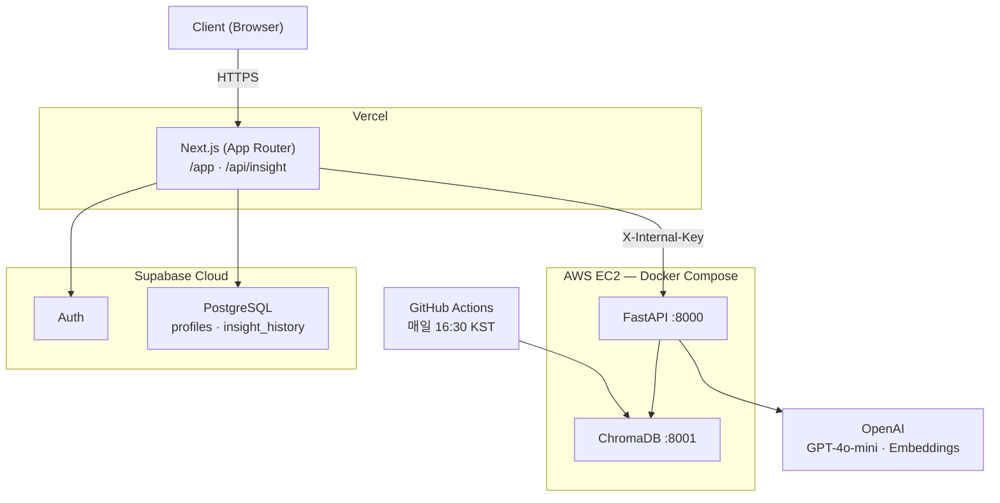

# FinSight Agent

> 고객 세그먼트 기반 맞춤형 투자 인사이트 AI 에이전트

금융 데이터 파이프라인과 RAG 기반 LLM을 활용하여, 사용자의 투자 성향(안전추구형·위험감수형·가치투자형)에 최적화된 시황 분석 및 종목 인사이트를 제공하는 MSA 기반 웹 서비스.

---

## 아키텍처



---

## 기술 스택

| 레이어 | 기술 |
|---|---|
| Frontend & BFF | TypeScript · Next.js 14 (App Router) · Tailwind CSS · Vercel |
| 인증 / DB | Supabase Auth · Supabase PostgreSQL |
| AI Backend | Python 3.11 · FastAPI · LangChain · ChromaDB |
| LLM / Embedding | OpenAI GPT-4o-mini · text-embedding-3-small |
| Pipeline | GitHub Actions (cron) · FinanceDataReader · OpenDart · Naver API |
| Infra | AWS EC2 · Docker Compose |

---

## 프로젝트 구조

```
finsight-ai-agent/
├── frontend/         # Next.js 14 프론트엔드 + API Route
│   └── app/
│       ├── (auth)/   # 로그인/회원가입 페이지
│       ├── api/      # API Route (/api/insight)
│       └── ...       # 인사이트, 이력, 설정 페이지
├── ai-server/        # FastAPI AI 에이전트 서버
│   └── app/
│       ├── api/      # 라우터
│       ├── agent/    # LangChain RAG 체인
│       ├── pipeline/ # 데이터 수집·정제·벡터화
│       └── core/     # 설정, 공통 유틸
├── pipeline/         # GitHub Actions 실행 스크립트
├── docker/           # Dockerfile 모음
├── docs/             # PRD, TECH_STACK, TASK, DEPLOYMENT
└── docker-compose.yml
```

---

## 로컬 실행

### 사전 준비

- Node.js 20+
- Docker / Docker Compose
- Python 3.11+
- Poetry (Python 패키지 매니저)

**Poetry 설치 (최초 1회)**

```bash
# macOS Homebrew Python을 사용하는 경우 (시스템 Python 3.9 사용 시 설치 오류 발생)
curl -sSL https://install.python-poetry.org | /opt/homebrew/bin/python3.11 -
echo 'export PATH="$HOME/.local/bin:$PATH"' >> ~/.zshrc
source ~/.zshrc
```

### 실행

```bash
git clone https://github.com/sammy0329/finsight-ai-agent.git
cd finsight-ai-agent

# 환경변수 설정
cp .env.example .env   # .env 값 채우기

# Python 의존성 설치
cd ai-server && poetry install && cd ..

# ChromaDB + FastAPI 실행 (Docker Compose)
docker compose up -d

# Next.js 개발 서버 실행
cd frontend
npm install
npm run dev
```

### 파이프라인 수동 실행

```bash
cd ai-server
export $(cat ../.env | grep -v '^#' | xargs)
CHROMA_HOST=localhost CHROMA_PORT=8001 PIPELINE_MARKET=KOR \
  poetry run python -m app.pipeline.run_pipeline
```

### 서비스 확인

| 서비스 | URL |
|---|---|
| Next.js | http://localhost:3000 |
| FastAPI Docs | http://localhost:8000/docs |

---

## 문서

| 문서 | 설명 |
|---|---|
| [PRD.md](./docs/PRD.md) | 제품 요구사항 정의서 |
| [TECH_STACK.md](./docs/TECH_STACK.md) | 기술 스택 명세 및 아키텍처 |
| [TASK.md](./docs/TASK.md) | Phase/Epic/Task 단위 작업 명세 |
| [DEPLOYMENT.md](./docs/DEPLOYMENT.md) | 배포 전략 및 인프라 구성 |
