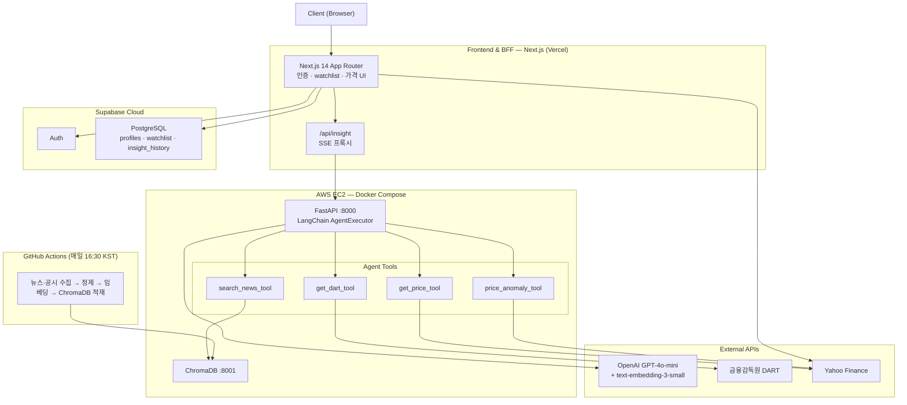

# FinSight Agent

> 고객 세그먼트 기반 맞춤형 투자 인사이트 AI 에이전트

뉴스·공시·실시간 가격 데이터를 **Multi-tool LangChain Agent**로 연계하여, 사용자의 투자 성향(안전추구형·위험감수형·가치투자형)에 따라 검색 전략과 답변 관점을 동시에 분기하는 개인화 투자 인사이트 웹 서비스.

---

## GPT 래퍼와의 차별점

일반적인 RAG 챗봇은 `질문 → 벡터 검색 → GPT 답변` 단계로 끝납니다.
FinSight Agent는 세 가지 측면에서 이를 넘어섭니다.

### 1. Multi-tool Agent — Agent가 데이터 소스를 스스로 선택

```
유저: "삼성전자 오늘 왜 이렇게 떨어졌어?"

Agent 판단:
  1. price_anomaly_tool  → Z-score 3.1 (이상 감지)
  2. search_news_tool    → 관련 뉴스 Top-5 (ChromaDB RAG)
  3. get_dart_tool       → 최근 30일 공시 확인

→ 세 결과를 세그먼트 B형(위험감수) 관점으로 종합
```

단순 검색이 아니라 **Agent가 질문 유형에 따라 필요한 도구를 판단·조합**합니다.

| 도구 | 데이터 소스 | 역할 |
|---|---|---|
| `search_news_tool` | ChromaDB (뉴스·공시 벡터 DB) | 관련 뉴스 시맨틱 검색 |
| `get_dart_tool` | 금융감독원 DART API | 기업 공시 직접 조회 |
| `get_price_tool` | Yahoo Finance API | 실시간 종가·등락률 |
| `price_anomaly_tool` | FinanceDataReader + 통계 | Z-score 기반 이상 감지 |

### 2. 세그먼트 기반 이중 분기 — 검색 전략 + 프롬프트 동시 분기

동일한 질문이라도 사용자 투자 성향에 따라 **검색 메타데이터 필터와 시스템 프롬프트가 모두 달라집니다**.

| 세그먼트 | 검색 전략 | 답변 관점 |
|---|---|---|
| A형 (안전추구) | 리스크·배당 카테고리 우선 필터 | 보수적, 리스크 강조 |
| B형 (위험감수) | 가격 이상·모멘텀 섹터 우선 필터 | 공격적, 기회 강조 |
| C형 (가치투자) | 공시·실적 문서 우선 필터 | 분석적, 펀더멘털 중심 |

### 3. 가격 이상 감지 — 데이터 기반 트리거

최근 20일 표준편차 기반 Z-score를 산출하여 **통계적으로 비정상적인 가격 변동을 자동 감지**하고, 그 원인을 뉴스·공시 데이터로 설명합니다.

---

## 아키텍처



---

## 기술 스택

| 레이어 | 기술 |
|---|---|
| Frontend & BFF | TypeScript · Next.js 14 (App Router) · Tailwind CSS · Vercel |
| 인증 / DB | Supabase Auth · Supabase PostgreSQL · RLS |
| AI Backend | Python 3.11 · FastAPI · LangChain AgentExecutor · ChromaDB |
| LLM / Embedding | OpenAI GPT-4o-mini · text-embedding-3-small |
| 실시간 가격 | Yahoo Finance API (lib/yahoo.ts, next.revalidate 캐시) |
| Pipeline | GitHub Actions · OpenDart API · Naver Search API · NewsAPI |
| Infra | AWS EC2 · Docker Compose |

---

## 프로젝트 구조

```
finsight-ai-agent/
├── frontend/               # Next.js 14 프론트엔드 + API Route
│   ├── app/
│   │   ├── (auth)/         # 로그인·온보딩
│   │   ├── (main)/         # 홈·검색·인사이트·이력·설정
│   │   └── api/            # /api/insight (SSE 프록시)
│   └── lib/
│       ├── supabase/       # 브라우저·서버 클라이언트
│       └── yahoo.ts        # 실시간 가격·시장 요약
├── ai-server/              # FastAPI AI 에이전트 서버
│   └── app/
│       ├── api/            # FastAPI 라우터
│       ├── agent/          # LangChain AgentExecutor + Tools
│       ├── pipeline/       # 데이터 수집·정제·벡터화
│       └── core/           # 설정·공통 유틸
├── docker/                 # Dockerfile 모음
├── docs/                   # PRD · TECH_STACK · TASK · DEPLOYMENT
└── docker-compose.yml
```

---

## 로컬 실행

### 사전 준비

- Node.js 20+
- Docker / Docker Compose
- Python 3.11+, Poetry

```bash
# Poetry 설치 (최초 1회)
curl -sSL https://install.python-poetry.org | python3 -
echo 'export PATH="$HOME/.local/bin:$PATH"' >> ~/.zshrc && source ~/.zshrc
```

### 실행

```bash
git clone https://github.com/sammy0329/finsight-ai-agent.git
cd finsight-ai-agent

# 환경변수 설정
cp .env.example .env          # .env 값 채우기
cp frontend/.env.local.example frontend/.env.local  # Supabase, FastAPI URL 입력

# Python 의존성 설치
cd ai-server && poetry install && cd ..

# ChromaDB + FastAPI 실행
docker compose up -d chromadb fastapi

# Next.js 개발 서버
cd frontend && npm install && npm run dev
```

### 파이프라인 수동 실행

```bash
cd ai-server
export $(cat ../.env | grep -v '^#' | xargs)
CHROMA_HOST=localhost CHROMA_PORT=8001 \
  poetry run python -m app.pipeline.run_pipeline
```

### 서비스 URL

| 서비스 | URL |
|---|---|
| Next.js | http://localhost:3000 |
| FastAPI Swagger | http://localhost:8000/docs |
| ChromaDB | http://localhost:8001 |

---

## 환경변수

| 변수명 | 위치 | 설명 |
|---|---|---|
| `NEXT_PUBLIC_SUPABASE_URL` | frontend/.env.local | Supabase 프로젝트 URL |
| `NEXT_PUBLIC_SUPABASE_ANON_KEY` | frontend/.env.local | Supabase anon key |
| `FASTAPI_URL` | frontend/.env.local | FastAPI 서버 주소 |
| `INTERNAL_API_KEY` | frontend/.env.local + .env | Next.js ↔ FastAPI 내부 인증키 (동일 값) |
| `OPENAI_API_KEY` | .env | OpenAI API 키 |
| `DART_API_KEY` | .env | 금융감독원 DART API 키 |
| `NAVER_CLIENT_ID/SECRET` | .env | Naver Search API 키 |
| `NEWS_API_KEY` | .env | NewsAPI 키 |

---

## 문서

| 문서 | 설명 |
|---|---|
| [PRD.md](./docs/PRD.md) | 제품 요구사항 정의서 — 기능·비기능 요구사항, Agent 도구 설계 |
| [TECH_STACK.md](./docs/TECH_STACK.md) | 기술 스택 명세 — 아키텍처 다이어그램, 시퀀스, 기술 선택 근거 |
| [TASK.md](./docs/TASK.md) | Phase/Epic/Task 단위 작업 명세 및 진행 상태 |
| [DEPLOYMENT.md](./docs/DEPLOYMENT.md) | 배포 전략 및 인프라 구성 |

---

> ⚠️ 본 서비스는 정보 제공 목적이며 투자를 권유하지 않습니다. 모든 투자 판단과 책임은 사용자 본인에게 있습니다.
