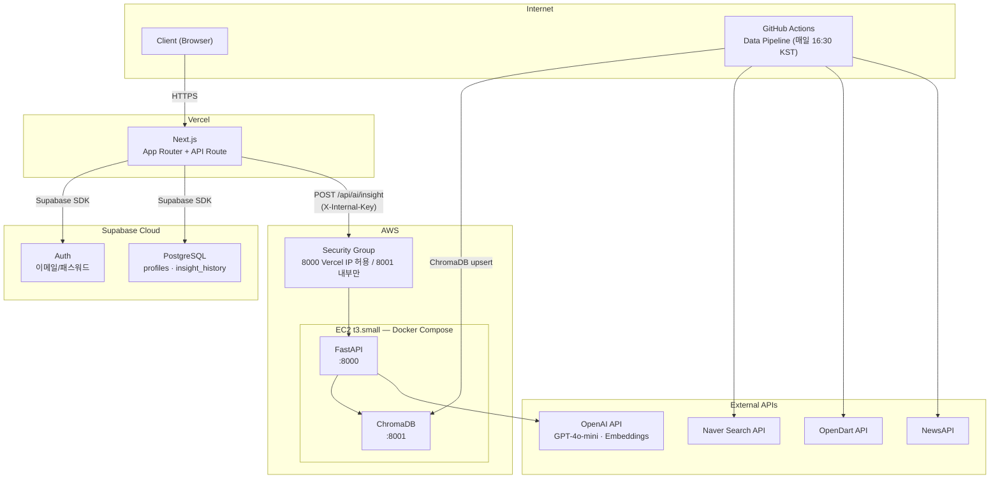
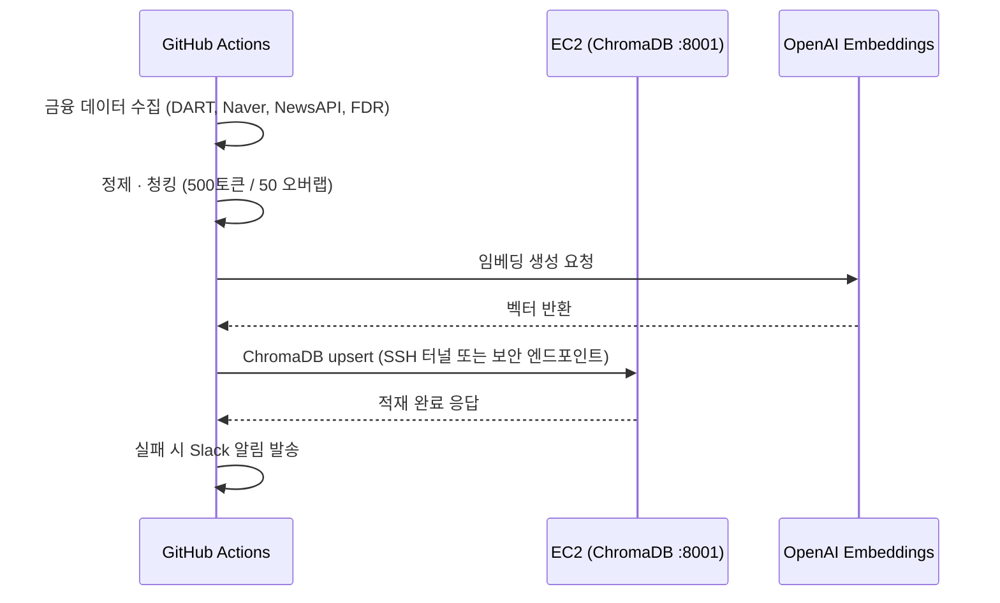
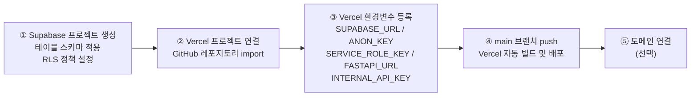
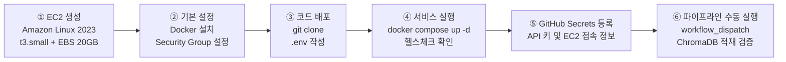

# 배포 명세서 (Deployment)

**프로젝트명:** FinSight Agent
**연관 문서:** [PRD.md](./PRD.md) · [TECH_STACK.md](./TECH_STACK.md)

---

## 배포 전략 요약

| 서비스 | 배포 환경 | 이유 |
|---|---|---|
| Next.js | Vercel | Next.js 최적화 플랫폼, 자동 CI/CD, 글로벌 CDN |
| Supabase | Supabase Cloud | 관리형 PostgreSQL + Auth, 별도 서버 불필요 |
| FastAPI | AWS EC2 (Docker) | ChromaDB 로컬 연결, 상시 대기 |
| ChromaDB | AWS EC2 (Docker) | 파일 기반 영속성, 네트워크 레이턴시 최소화 |
| Data Pipeline | GitHub Actions | 별도 서버 불필요, CI/CD 통합 |

---

## 인프라 아키텍처



---

## EC2 인스턴스 구성

### 사양

| 항목 | 값 |
|---|---|
| 인스턴스 타입 | t3.small (vCPU 2, Memory 2GB) |
| OS | Amazon Linux 2023 |
| 스토리지 | EBS gp3 20GB (ChromaDB 벡터 데이터 영속성) |
| 탄력적 IP | 고정 IP 할당 |

### Security Group 규칙

| 포트 | 프로토콜 | 허용 대상 | 용도 |
|---|---|---|---|
| 22 | TCP | 내 IP만 | SSH 접속 |
| 8000 | TCP | Vercel 아웃바운드 IP (또는 0.0.0.0/0) | FastAPI (Next.js API Route → FastAPI) |
| 8001 | TCP | EC2 내부만 | ChromaDB (FastAPI → ChromaDB) |

> **보안 원칙:** ChromaDB는 외부에 직접 노출하지 않는다. FastAPI가 유일한 진입점이며, `X-Internal-Key` 헤더로 Next.js 요청을 검증한다.

---

## Docker Compose 구성 (EC2)

```yaml
# docker-compose.yml
version: "3.9"

services:
  fastapi:
    build: ./ai-server
    ports:
      - "8000:8000"
    environment:
      - OPENAI_API_KEY=${OPENAI_API_KEY}
      - CHROMA_HOST=chromadb
      - CHROMA_PORT=8001
      - INTERNAL_API_KEY=${INTERNAL_API_KEY}
    depends_on:
      chromadb:
        condition: service_healthy
    healthcheck:
      test: ["CMD", "curl", "-f", "http://localhost:8000/health"]
      interval: 30s
      timeout: 10s
      retries: 3
    restart: unless-stopped

  chromadb:
    image: chromadb/chroma:latest
    ports:
      - "127.0.0.1:8001:8000"   # 로컬호스트만 노출
    volumes:
      - chroma_data:/chroma/chroma  # EBS 볼륨에 영속
    healthcheck:
      test: ["CMD", "curl", "-f", "http://localhost:8000/api/v1/heartbeat"]
      interval: 30s
      timeout: 10s
      retries: 3
    restart: unless-stopped

volumes:
  chroma_data:
    driver: local
```

---

## Supabase 구성

| 항목 | 값 |
|---|---|
| 플랜 | Free Tier (500MB DB, 50MB Storage) |
| 리전 | Northeast Asia (ap-northeast-1) |
| Auth 방식 | 이메일/패스워드 |
| 테이블 | `profiles`, `insight_history` |
| RLS | 활성화 (user_id 기반 행 수준 보안) |
| 백업 | Supabase 자동 일 단위 백업 (Free Tier) |

```sql
-- Supabase SQL Editor에서 실행
create table profiles (
  user_id uuid primary key references auth.users(id) on delete cascade,
  segment text not null check (segment in ('A', 'B', 'C')),
  created_at timestamptz default now()
);

create table insight_history (
  id uuid primary key default gen_random_uuid(),
  user_id uuid references auth.users(id) on delete cascade,
  query text not null,
  response text not null,
  created_at timestamptz default now()
);

alter table profiles enable row level security;
alter table insight_history enable row level security;

create policy "Users can read own profile"
  on profiles for select using (auth.uid() = user_id);

create policy "Users can read own history"
  on insight_history for select using (auth.uid() = user_id);
```

---

## GitHub Actions — 파이프라인 배포 연동

ChromaDB가 EC2에서 실행되므로, GitHub Actions에서 EC2의 ChromaDB에 직접 upsert한다.



### GitHub Actions Secrets 목록

| Secret 키 | 설명 |
|---|---|
| `OPENAI_API_KEY` | OpenAI API 인증 키 |
| `DART_API_KEY` | 금융감독원 OpenDart API 키 |
| `NAVER_CLIENT_ID` | Naver Search API Client ID |
| `NAVER_CLIENT_SECRET` | Naver Search API Client Secret |
| `NEWS_API_KEY` | NewsAPI 인증 키 |
| `EC2_HOST` | EC2 탄력적 IP |
| `EC2_SSH_KEY` | EC2 접속용 PEM 키 (Base64 인코딩) |
| `SLACK_WEBHOOK_URL` | 파이프라인 알림용 Slack Incoming Webhook |

---

## 환경변수 관리

```bash
# .env.example  (실제 값은 .env에 작성, git 제외)

# FastAPI (EC2)
OPENAI_API_KEY=sk-...
CHROMA_HOST=chromadb
CHROMA_PORT=8001
INTERNAL_API_KEY=your_internal_api_key

# Next.js (Vercel 환경변수로 등록)
NEXT_PUBLIC_SUPABASE_URL=https://your-project.supabase.co
NEXT_PUBLIC_SUPABASE_ANON_KEY=your_supabase_anon_key
SUPABASE_SERVICE_ROLE_KEY=your_supabase_service_role_key
FASTAPI_URL=http://your-ec2-ip:8000
INTERNAL_API_KEY=your_internal_api_key
```

---

## 배포 절차

### Vercel (Next.js) 배포



### EC2 (FastAPI + ChromaDB) 배포



### 주요 명령어

```bash
# EC2 접속
ssh -i finsight-key.pem ec2-user@{EC2_HOST}

# Docker 설치 (Amazon Linux 2023)
sudo dnf install -y docker
sudo systemctl enable --now docker
sudo usermod -aG docker ec2-user

# Docker Compose 설치
sudo curl -L "https://github.com/docker/compose/releases/latest/download/docker-compose-$(uname -s)-$(uname -m)" \
  -o /usr/local/bin/docker-compose
sudo chmod +x /usr/local/bin/docker-compose

# 서비스 실행
git clone https://github.com/sammy0329/finsight-ai-agent.git
cd finsight-ai-agent
cp .env.example .env   # .env 값 채우기
docker-compose up -d --build

# 로그 확인
docker-compose logs -f fastapi
docker-compose logs -f chromadb
```

---

## 운영 및 업데이트 절차

```bash
# FastAPI 코드 업데이트 후 재배포 (EC2)
git pull origin main
docker-compose up -d --build --no-deps fastapi

# Next.js 업데이트 — main 브랜치 push 시 Vercel 자동 배포
git push origin main
```

---

## 향후 확장 방향

현재 구성은 포트폴리오 목적의 단일 인스턴스 구성이다.
실제 프로덕션 전환 시 아래 경로로 마이그레이션한다.

| 현재 | 프로덕션 전환 시 |
|---|---|
| EC2 단일 인스턴스 (Docker Compose) | ECS Fargate (서비스별 독립 컨테이너) |
| ChromaDB (로컬 파일) | Pinecone 또는 Weaviate Cloud |
| Supabase Free Tier | Supabase Pro (고가용성, 더 큰 스토리지) |
| GitHub Actions Pipeline | Apache Airflow (복잡한 DAG 관리) |
| Vercel 자동 배포 | CI/CD 파이프라인 고도화 (스테이징 환경 분리) |
