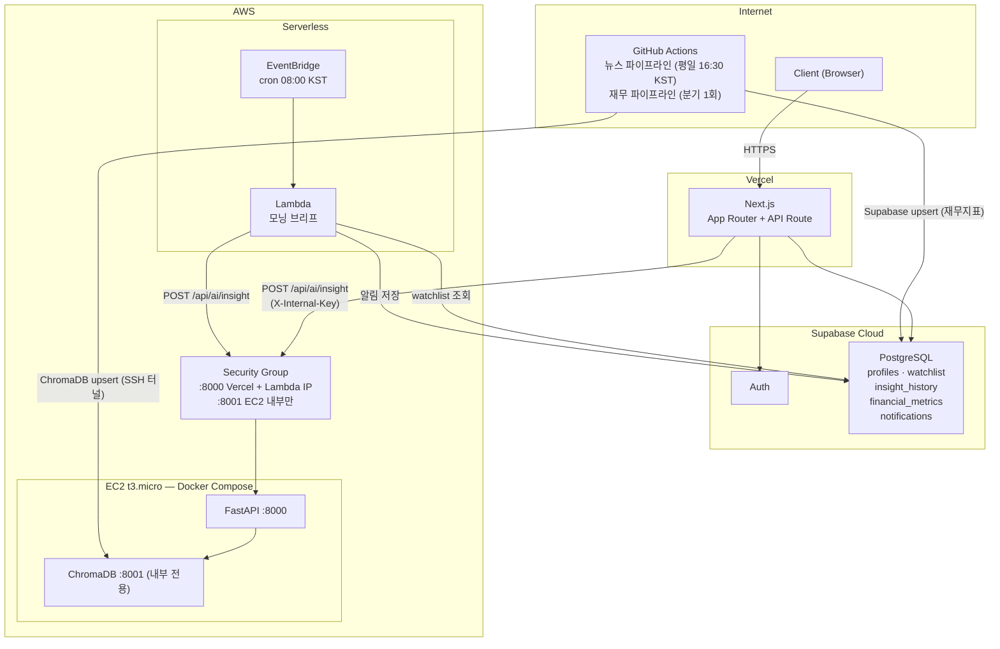
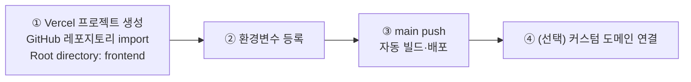

# 배포 명세서 (Deployment)

**프로젝트명:** FinSight Agent
**연관 문서:** [PRD.md](./PRD.md) · [TECH_STACK.md](./TECH_STACK.md)

---

## 배포 전략 요약

| 서비스 | 배포 환경 | 이유 |
|---|---|---|
| Next.js | Vercel | Next.js 최적화 플랫폼, 자동 CI/CD, 글로벌 CDN |
| Supabase | Supabase Cloud | 관리형 PostgreSQL + Auth, 별도 서버 불필요 |
| FastAPI + ChromaDB | AWS EC2 t3.micro (Docker Compose) | ChromaDB 로컬 연결, 상시 대기 |
| 모닝 브리프 스케줄러 | AWS Lambda + EventBridge | 일 1회 배치, 상시 구동 불필요, 사실상 무료 |
| 뉴스 데이터 파이프라인 | GitHub Actions | 별도 서버 불필요, CI/CD 통합 |
| 재무 데이터 파이프라인 | GitHub Actions | 분기 1회, workflow_dispatch 수동 실행 지원 |

---

## 인프라 아키텍처



---

## 1. EC2 인스턴스 구성 (FastAPI + ChromaDB)

### 사양

| 항목 | 값 |
|---|---|
| 인스턴스 타입 | t3.micro (vCPU 2, Memory 1GB) |
| OS | Amazon Linux 2023 |
| 스토리지 | EBS gp3 20GB (ChromaDB 벡터 데이터 영속성) |
| 탄력적 IP | 고정 IP 할당 |

### Security Group 규칙

| 포트 | 프로토콜 | 허용 대상 | 용도 |
|---|---|---|---|
| 22 | TCP | 내 IP만 | SSH 접속 |
| 8000 | TCP | 0.0.0.0/0 (또는 Vercel + Lambda IP) | FastAPI |
| 8001 | TCP | EC2 내부만 (127.0.0.1) | ChromaDB (외부 노출 금지) |

### 배포 절차

```bash
# 1. EC2 접속
ssh -i finsight-key.pem ec2-user@{ELASTIC_IP}

# 2. Docker 설치 (Amazon Linux 2023)
sudo dnf install -y docker git
sudo systemctl enable --now docker
sudo usermod -aG docker ec2-user
# 재로그인 후 적용

# 3. Docker Compose v2 설치
DOCKER_CONFIG=${DOCKER_CONFIG:-$HOME/.docker}
mkdir -p $DOCKER_CONFIG/cli-plugins
curl -SL "https://github.com/docker/compose/releases/latest/download/docker-compose-linux-x86_64" \
  -o $DOCKER_CONFIG/cli-plugins/docker-compose
chmod +x $DOCKER_CONFIG/cli-plugins/docker-compose

# 4. 코드 배포
git clone https://github.com/sammy0329/finsight-ai-agent.git
cd finsight-ai-agent
cp .env.example .env
# .env에 OPENAI_API_KEY, INTERNAL_API_KEY, SUPABASE_URL, SUPABASE_SERVICE_ROLE_KEY,
# ALLOWED_ORIGINS=https://your-app.vercel.app 입력

# 5. 프로덕션 서비스 실행 (FastAPI + ChromaDB만)
docker compose -f docker-compose.prod.yml up -d --build
docker compose -f docker-compose.prod.yml ps    # 상태 확인

# 6. 헬스체크
curl http://localhost:8000/health
# → {"status":"ok","chroma":"connected"}
```

### 코드 업데이트

```bash
git pull origin main
docker compose -f docker-compose.prod.yml up -d --build --no-deps fastapi
```

---

## 2. Vercel 배포 (Next.js)

### 배포 절차



### Vercel 환경변수 목록

| 변수명 | 설명 |
|---|---|
| `NEXT_PUBLIC_SUPABASE_URL` | Supabase 프로젝트 URL |
| `NEXT_PUBLIC_SUPABASE_ANON_KEY` | Supabase anon key |
| `SUPABASE_SERVICE_ROLE_KEY` | Supabase service role key (서버사이드 전용) |
| `FASTAPI_URL` | `http://{EC2_ELASTIC_IP}:8000` |
| `INTERNAL_API_KEY` | Next.js ↔ FastAPI 내부 인증키 (`.env`와 동일 값) |

> **CORS 설정**: EC2 `.env`의 `ALLOWED_ORIGINS`에 Vercel 배포 URL을 추가해야 합니다.
> ```
> ALLOWED_ORIGINS=https://your-app.vercel.app,http://localhost:3000
> ```

---

## 3. AWS Lambda + EventBridge (모닝 브리프)

### Lambda 함수 구성

| 항목 | 값 |
|---|---|
| 런타임 | Python 3.11 |
| 메모리 | 256MB |
| Timeout | 5분 |
| 트리거 | EventBridge (cron) |

### EventBridge cron 표현식

```
cron(0 23 ? * MON-FRI *)
```
→ UTC 23:00 = KST 08:00, 평일만 실행

### Lambda 환경변수

| 변수명 | 설명 |
|---|---|
| `FASTAPI_URL` | `http://{EC2_ELASTIC_IP}:8000` |
| `INTERNAL_API_KEY` | FastAPI 내부 인증키 |
| `SUPABASE_URL` | Supabase 프로젝트 URL |
| `SUPABASE_SERVICE_ROLE_KEY` | Supabase service role key (watchlist 조회, 알림 저장) |

### Lambda 배포 절차

```bash
# Lambda 패키지 빌드
cd lambda/morning_brief
pip install -r requirements.txt -t ./package
cd package && zip -r ../morning_brief.zip . && cd ..
zip morning_brief.zip handler.py

# AWS CLI로 배포
aws lambda create-function \
  --function-name finsight-morning-brief \
  --runtime python3.11 \
  --handler handler.lambda_handler \
  --zip-file fileb://morning_brief.zip \
  --role arn:aws:iam::{ACCOUNT_ID}:role/lambda-execution-role \
  --timeout 300 \
  --memory-size 256

# 환경변수 설정
aws lambda update-function-configuration \
  --function-name finsight-morning-brief \
  --environment "Variables={FASTAPI_URL=...,INTERNAL_API_KEY=...,SUPABASE_URL=...,SUPABASE_SERVICE_ROLE_KEY=...}"

# EventBridge Rule 연결
aws events put-rule \
  --name finsight-morning-brief-rule \
  --schedule-expression "cron(0 23 ? * MON-FRI *)"
```

---

## 4. GitHub Actions 파이프라인

### Secrets 목록

| Secret 키 | 설명 |
|---|---|
| `OPENAI_API_KEY` | OpenAI API 키 |
| `DART_API_KEY` | 금융감독원 OpenDart API 키 |
| `NAVER_CLIENT_ID` | Naver Search API Client ID |
| `NAVER_CLIENT_SECRET` | Naver Search API Client Secret |
| `NEWS_API_KEY` | NewsAPI 키 |
| `EC2_HOST` | EC2 탄력적 IP |
| `EC2_SSH_KEY` | EC2 접속용 PEM 키 (Base64 인코딩: `base64 -i finsight-key.pem`) |
| `SUPABASE_URL` | Supabase 프로젝트 URL |
| `SUPABASE_SERVICE_ROLE_KEY` | 파이프라인·리포트 upsert용 service role key |
| `INTERNAL_API_KEY` | FastAPI 내부 인증키 |
| `SLACK_WEBHOOK_URL` | 파이프라인 알림용 Slack Webhook (선택) |

### 파이프라인 종류

| 워크플로우 | 스케줄 | 역할 |
|---|---|---|
| `daily-pipeline.yml` | 평일 UTC 07:30 (KST 16:30) | KOR 뉴스·공시 수집 → ChromaDB upsert |
| `us-pipeline.yml` | 평일 UTC 22:00 (KST 07:00) | US 뉴스 수집 → ChromaDB upsert |
| `financial-pipeline.yml` | 분기 1회 + 수동 | 재무제표 수집 → Supabase upsert |
| `report-pipeline.yml` | 4종 cron (UTC 07:45 / 22:45 / 23:00 / 13:30) | 리포트 생성 → notifications 삽입 |

---

## 5. 환경변수 전체 목록

```bash
# .env (EC2 FastAPI + 로컬 개발 공용)
OPENAI_API_KEY=sk-...
CHROMA_HOST=chromadb          # Docker 내부: chromadb, 로컬: localhost
CHROMA_PORT=8001
INTERNAL_API_KEY=your_shared_key
DART_API_KEY=...
NAVER_CLIENT_ID=...
NAVER_CLIENT_SECRET=...
NEWS_API_KEY=...

# frontend/.env.local (Next.js)
NEXT_PUBLIC_SUPABASE_URL=https://xxx.supabase.co
NEXT_PUBLIC_SUPABASE_ANON_KEY=...
FASTAPI_URL=http://localhost:8000     # 배포 시 EC2 IP로 변경
INTERNAL_API_KEY=your_shared_key      # .env와 동일 값
```

---

## 6. 향후 확장 방향

현재 구성은 포트폴리오 목적의 단일 인스턴스 구성이다.

| 현재 | 프로덕션 전환 시 |
|---|---|
| EC2 t3.micro (Docker Compose) | ECS Fargate (서비스별 독립 컨테이너) |
| ChromaDB (로컬 파일) | Pinecone 또는 Weaviate Cloud |
| Lambda 단일 함수 | Step Functions (복잡한 배치 오케스트레이션) |
| GitHub Actions 파이프라인 | Apache Airflow (DAG 관리) |
| Supabase Free Tier | Supabase Pro (고가용성) |
