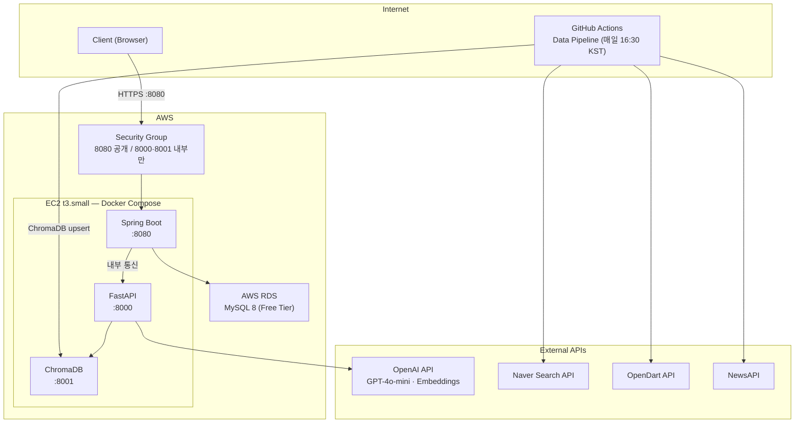
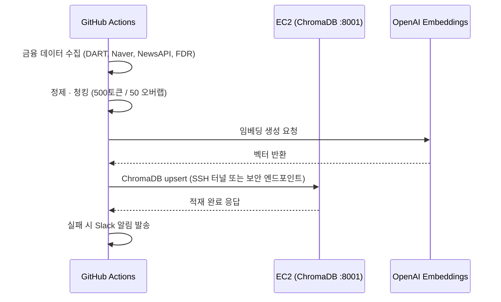
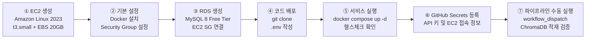

# 배포 명세서 (Deployment)

**프로젝트명:** FinSight Agent
**연관 문서:** [PRD.md](./PRD.md) · [TECH_STACK.md](./TECH_STACK.md)

---

## 배포 전략 요약

| 서비스 | 배포 환경 | 이유 |
|---|---|---|
| Spring Boot | AWS EC2 (Docker) | 상시 실행, JWT 세션, DB 연결 유지 |
| FastAPI | AWS EC2 (Docker) | ChromaDB 로컬 연결, 상시 대기 |
| ChromaDB | AWS EC2 (Docker) | 파일 기반 영속성, 네트워크 레이턴시 최소화 |
| MySQL | AWS RDS (Free Tier) | 관계형 데이터 영속성, 자동 백업 |
| Data Pipeline | GitHub Actions | 별도 서버 불필요, CI/CD 통합 |

---

## 인프라 아키텍처



---

## EC2 인스턴스 구성

### 사양

| 항목 | 값 |
|---|---|
| 인스턴스 타입 | t3.small (vCPU 2, Memory 2GB) |
| OS | Amazon Linux 2023 |
| 스토리지 | EBS gp3 20GB (ChromaDB 벡터 데이터 영속성) |
| 탄력적 IP | 고정 IP 할당 |

### Security Group 규칙

| 포트 | 프로토콜 | 허용 대상 | 용도 |
|---|---|---|---|
| 22 | TCP | 내 IP만 | SSH 접속 |
| 8080 | TCP | 0.0.0.0/0 | Spring Boot (클라이언트 접근) |
| 8000 | TCP | EC2 내부만 | FastAPI (Spring Boot → FastAPI) |
| 8001 | TCP | EC2 내부만 | ChromaDB (FastAPI → ChromaDB) |

> **보안 원칙:** FastAPI와 ChromaDB는 외부에 직접 노출하지 않는다. Spring Boot가 유일한 진입점.

---

## Docker Compose 구성

```yaml
# docker-compose.yml
version: "3.9"

services:
  spring-boot:
    build: ./backend
    ports:
      - "8080:8080"
    environment:
      - SPRING_PROFILES_ACTIVE=prod
      - DB_HOST=${DB_HOST}
      - DB_PASSWORD=${DB_PASSWORD}
      - JWT_SECRET=${JWT_SECRET}
      - AI_SERVER_URL=http://fastapi:8000
      - INTERNAL_API_KEY=${INTERNAL_API_KEY}
    depends_on:
      fastapi:
        condition: service_healthy
    restart: unless-stopped

  fastapi:
    build: ./ai-server
    ports:
      - "127.0.0.1:8000:8000"   # 로컬호스트만 노출
    environment:
      - OPENAI_API_KEY=${OPENAI_API_KEY}
      - CHROMA_HOST=chromadb
      - CHROMA_PORT=8001
      - INTERNAL_API_KEY=${INTERNAL_API_KEY}
    depends_on:
      chromadb:
        condition: service_healthy
    healthcheck:
      test: ["CMD", "curl", "-f", "http://localhost:8000/health"]
      interval: 30s
      timeout: 10s
      retries: 3
    restart: unless-stopped

  chromadb:
    image: chromadb/chroma:latest
    ports:
      - "127.0.0.1:8001:8000"   # 로컬호스트만 노출
    volumes:
      - chroma_data:/chroma/chroma  # EBS 볼륨에 영속
    healthcheck:
      test: ["CMD", "curl", "-f", "http://localhost:8000/api/v1/heartbeat"]
      interval: 30s
      timeout: 10s
      retries: 3
    restart: unless-stopped

volumes:
  chroma_data:
    driver: local
```

---

## RDS 구성

| 항목 | 값 |
|---|---|
| 엔진 | MySQL 8.0 |
| 인스턴스 클래스 | db.t3.micro (Free Tier) |
| 스토리지 | gp2 20GB |
| 퍼블릭 액세스 | 비활성화 (EC2에서만 접근) |
| 백업 보존 기간 | 7일 |
| Security Group | EC2 Security Group에서만 3306 허용 |

---

## GitHub Actions — 파이프라인 배포 연동

ChromaDB가 EC2에서 실행되므로, GitHub Actions에서 EC2의 ChromaDB에 직접 upsert한다.



### GitHub Actions Secrets 목록

| Secret 키 | 설명 |
|---|---|
| `OPENAI_API_KEY` | OpenAI API 인증 키 |
| `DART_API_KEY` | 금융감독원 OpenDart API 키 |
| `NAVER_CLIENT_ID` | Naver Search API Client ID |
| `NAVER_CLIENT_SECRET` | Naver Search API Client Secret |
| `NEWS_API_KEY` | NewsAPI 인증 키 |
| `EC2_HOST` | EC2 탄력적 IP |
| `EC2_SSH_KEY` | EC2 접속용 PEM 키 (Base64 인코딩) |
| `SLACK_WEBHOOK_URL` | 파이프라인 알림용 Slack Incoming Webhook |

---

## 환경변수 관리

```bash
# .env.example  (실제 값은 .env에 작성, git 제외)

# Spring Boot
DB_HOST=your-rds-endpoint.rds.amazonaws.com
DB_PASSWORD=your_db_password
JWT_SECRET=your_jwt_secret_min_32chars
INTERNAL_API_KEY=your_internal_api_key

# FastAPI
OPENAI_API_KEY=sk-...
CHROMA_HOST=chromadb
CHROMA_PORT=8001

# 공통
INTERNAL_API_KEY=your_internal_api_key
```

---

## 배포 절차 (최초 배포)



### 주요 명령어

```bash
# EC2 접속
ssh -i finsight-key.pem ec2-user@{EC2_HOST}

# Docker 설치 (Amazon Linux 2023)
sudo dnf install -y docker
sudo systemctl enable --now docker
sudo usermod -aG docker ec2-user

# Docker Compose 설치
sudo curl -L "https://github.com/docker/compose/releases/latest/download/docker-compose-$(uname -s)-$(uname -m)" \
  -o /usr/local/bin/docker-compose
sudo chmod +x /usr/local/bin/docker-compose

# 서비스 실행
git clone https://github.com/sammy0329/finsight-ai-agent.git
cd finsight-ai-agent
cp .env.example .env   # .env 값 채우기
docker-compose up -d --build

# 로그 확인
docker-compose logs -f spring-boot
docker-compose logs -f fastapi
```

---

## 운영 및 업데이트 절차

```bash
# 코드 업데이트 후 재배포
git pull origin main
docker-compose up -d --build --no-deps spring-boot  # 특정 서비스만 재빌드
```

---

## 향후 확장 방향

현재 구성은 포트폴리오 목적의 단일 인스턴스 구성이다.
실제 프로덕션 전환 시 아래 경로로 마이그레이션한다.

| 현재 | 프로덕션 전환 시 |
|---|---|
| EC2 단일 인스턴스 (Docker Compose) | ECS Fargate (서비스별 독립 컨테이너) |
| ChromaDB (로컬 파일) | Pinecone 또는 Weaviate Cloud |
| RDS Free Tier | RDS Multi-AZ (고가용성) |
| GitHub Actions Pipeline | Apache Airflow (복잡한 DAG 관리) |
| 수동 배포 | CI/CD 자동 배포 (GitHub Actions → ECS) |
