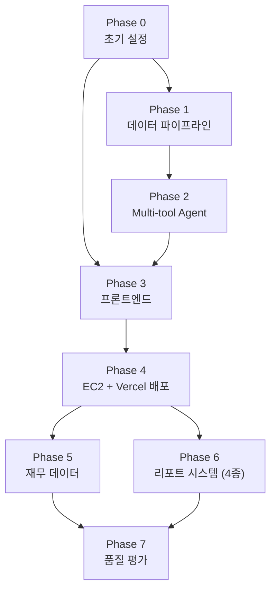

# 작업 명세서 (TASK)

**프로젝트명:** FinSight Agent
**연관 문서:** [PRD.md](./PRD.md) · [TECH_STACK.md](./TECH_STACK.md)

---

## 진행 상태 범례

| 기호 | 의미 |
|---|---|
| `[ ]` | 미시작 |
| `[~]` | 진행 중 |
| `[x]` | 완료 |
| `[!]` | 블로킹 / 보류 |

---

## Phase 0. 프로젝트 초기 설정

### Epic 0-1. 레포지토리 및 디렉토리 구조 설정

- [x] **T-001** GitHub 레포지토리 생성 확인 (main 브랜치 단일 운용)
- [x] **T-002** 모노레포 디렉토리 구조 생성
- [x] **T-003** `.gitignore` 설정 (환경변수 파일 제외)
- [x] **T-004** `README.md` 초안 작성

### Epic 0-2. 로컬 개발 환경 구성

- [x] **T-005** `docker-compose.yml` 작성 (fastapi, chromadb 서비스)
- [x] **T-006** `.env.example` 파일 작성
- [x] **T-007** Docker Compose 전체 실행 및 헬스체크 확인

---

## Phase 1. 데이터 파이프라인 구축 ✅

### Epic 1-1. Python 프로젝트 초기화

- [x] **T-101** Poetry 프로젝트 초기화 및 `pyproject.toml` 의존성 정의
- [x] **T-102** 디렉토리 구조 설정 (api / agent / pipeline / core)
- [x] **T-103** Ruff, Black 설정 및 pre-commit hook 적용

### Epic 1-2. 데이터 수집 모듈 개발

- [x] **T-104** FinanceDataReader 국내 주가 수집 모듈
- [x] **T-105** 금융감독원 OpenDart API 공시 수집 모듈
- [x] **T-106** Naver Search API 국내 금융 뉴스 수집 모듈
- [x] **T-107** NewsAPI 미국 금융 뉴스 수집 모듈

### Epic 1-3. 데이터 정제 및 구조화

- [x] **T-108** 수집 데이터 정제 공통 모듈 (HTML 태그 제거, 중복 제거)
- [x] **T-109** 메타데이터 부착 모듈 (source, market, category, sentiment)
- [x] **T-110** Pydantic 스키마 검증

### Epic 1-4. 청킹 및 벡터화

- [x] **T-111** ChromaDB 클라이언트 초기화 및 컬렉션 생성 (`news_kor`, `news_us`)
- [x] **T-112** RecursiveCharacterTextSplitter 500토큰 / 50 오버랩 청킹
- [x] **T-113** OpenAI text-embedding-3-small 임베딩 모듈
- [x] **T-114** ChromaDB upsert 모듈 (id 기반 멱등성)
- [x] **T-115** 전체 파이프라인 통합 실행 스크립트 (`run_pipeline.py`)

### Epic 1-5. GitHub Actions 자동화

- [x] **T-116** `.github/workflows/daily-pipeline.yml` 작성 (평일 16:30 KST)
- [x] **T-117** GitHub Actions Secrets 등록
- [x] **T-118** 파이프라인 실패 시 재시도 로직 (최대 2회)
- [x] **T-119** 파이프라인 완료/실패 Slack 알림 연동
- [!] **T-120** 파이프라인 수동 실행 및 ChromaDB 정상 적재 검증 — EC2 배포 후 실행 필요

### Epic 1-6. 파이프라인 수집 품질 개선

- [x] **T-121** 시장별 카테고리 쿼리 설정 파일 (`query_config.py`) — KOR 8개, US 6개
- [x] **T-122** 멀티쿼리 수집 래퍼 함수 (category 필드 자동 부착)
- [x] **T-123** URL 기반 중복 제거 유틸리티 (`dedup.py`)
- [x] **T-124** 메타데이터 카테고리 동적 반영 (`metadata_builder.py`)
- [x] **T-125** `run_pipeline.py` 멀티쿼리 통합 수정
- [x] **T-126** 신규 모듈 단위 테스트 (dedup, query_config, multi-fetch)

---

## Phase 2. Multi-tool AI 에이전트 구현 ✅

### Epic 2-1. FastAPI 서버 기반 구성

- [x] **T-201** FastAPI 앱 초기화 및 라우터 구조 설정
- [x] **T-202** 요청/응답 Pydantic 스키마 정의 (InsightRequest, InsightResponse)
- [x] **T-203** 내부 서비스 인증 미들웨어 (`X-Internal-Key` 헤더 검증)
- [x] **T-204** `/health` 엔드포인트 (Docker 헬스체크용)

### Epic 2-2. 세그먼트별 프롬프트 설계

- [x] **T-205** 프롬프트 템플릿 기반 구조 (LangChain ChatPromptTemplate)
- [x] **T-206** 안전추구형 (A형) 시스템 프롬프트
- [x] **T-207** 위험감수형 (B형) 시스템 프롬프트
- [x] **T-208** 가치투자형 (C형) 시스템 프롬프트
- [x] **T-209** 세그먼트 코드 → 프롬프트 매핑 팩토리 함수

### Epic 2-3. RAG 체인 구현 (기반)

- [x] **T-210** ChromaDB Retriever 설정 (메타데이터 필터)
- [x] **T-211** LangChain LCEL 체인 구성
- [x] **T-212** `POST /api/ai/insight` 엔드포인트
- [x] **T-213** LLM 스트리밍 응답 (`POST /api/ai/insight/stream`)
- [x] **T-214** 폴백 처리 (검색 결과 없을 시 안내 메시지)

### Epic 2-4. 단위 테스트

- [x] **T-215** 수집 모듈 단위 테스트 (Mock API 응답)
- [x] **T-216** 청킹·임베딩 모듈 단위 테스트
- [x] **T-217** RAG 체인 단위 테스트 (Mock LLM, Mock ChromaDB)
- [x] **T-218** 프롬프트 분기 로직 단위 테스트

### Epic 2-5. Multi-tool Agent 전환

- [x] **T-219** LangChain AgentExecutor 기반 구조 (`create_openai_tools_agent`)
- [x] **T-220** `search_news_tool` — ChromaDB RAG 뉴스 검색
- [x] **T-221** `get_dart_tool` — DART 최근 30일 공시 목록 (최대 10건)
- [x] **T-222** `get_price_tool` — Yahoo Finance 현재가·등락률
- [x] **T-223** `price_anomaly_tool` — Z-score 이상 감지 (|Z| > 2 기준)
- [x] **T-224** Agent 프롬프트 재설계 (`get_agent_prompt_for_segment()`, market 파라미터 안내 포함)
- [x] **T-225** Agent 스트리밍 응답 (`astream_events` v2 기반)

### Epic 2-6. 가격 이상 감지 프론트엔드 연동

- [x] **T-226** 홈 화면 이상 감지 배지 (`AnomalyBadge` 클라이언트 컴포넌트)
- [x] **T-227** 인사이트 페이지 이상 감지 자동 트리거 + "원인 분석하기 →" 버튼

---

## Phase 3. Next.js + Supabase 프론트엔드 구현 ✅

### Epic 3-1. 프로젝트 초기화

- [x] **T-301** Next.js 14 프로젝트 생성 (App Router, TypeScript, Tailwind CSS)
- [x] **T-302** Supabase 프로젝트 생성 및 환경변수 설정
- [x] **T-303** Supabase 테이블 스키마 생성 (profiles, watchlist, stocks, insight_history)

### Epic 3-2. 인증 구현

- [x] **T-304** Supabase 클라이언트 유틸 설정 (client.ts, server.ts)
- [x] **T-305** 로그인/회원가입 페이지 (/login)
- [x] **T-306** 세그먼트 선택 온보딩 (/onboarding)
- [x] **T-307** 미들웨어 기반 인증 라우트 보호 (middleware.ts)

### Epic 3-3. 관심 종목 기능

- [x] **T-308** 종목 검색 API Route (`/api/stocks/search`)
- [x] **T-309** 종목 검색 페이지 (/search) — 실시간 검색, watchlist 추가/제거
- [x] **T-310** 홈 페이지 (/) — watchlist 카드, 시장 요약 배너
- [x] **T-311** Yahoo Finance 실시간 가격 연동 (`lib/yahoo.ts`)

### Epic 3-4. 인사이트 화면

- [x] **T-312** FastAPI 프록시 API Route (`/api/insight` — SSE passthrough)
- [x] **T-313** 종목 인사이트 페이지 (/insight/[ticker])
  - 종목 가격 카드, RAG 인사이트 스트리밍, 출처 뉴스 칩, 추가 질문 입력창
- [x] **T-314** 세그먼트별 UI 테마 분기 (A: 파랑, B: 빨강, C: 초록)
- [x] **T-315** 인사이트 이력 저장 (insight_history 테이블)

### Epic 3-5. 이력 및 설정 화면

- [x] **T-316** 이력 페이지 (/history) — 날짜별 인사이트 목록
- [x] **T-317** 설정 페이지 (/settings) — 세그먼트 변경, 종목 관리, 로그아웃

---

## Phase 4. EC2 + Vercel 배포

> **목표:** 로컬 개발 환경을 실제 운영 인프라로 전환한다. FastAPI+ChromaDB는 EC2에, Next.js는 Vercel에 배포한다.

### Epic 4-1. EC2 배포 (FastAPI + ChromaDB)

- [ ] **T-401** EC2 인스턴스 생성 (t3.micro, Amazon Linux 2023, EBS 20GB)
- [ ] **T-402** Security Group 설정 (SSH:22, FastAPI:8000 Vercel IP, ChromaDB:8001 내부만)
- [ ] **T-403** 탄력적 IP(Elastic IP) 할당
- [ ] **T-404** EC2 기본 환경 구성 (Docker, Docker Compose, git 설치)
- [ ] **T-405** 코드 배포 및 `.env` 작성, `docker compose up -d --build` 실행
- [ ] **T-406** FastAPI 헬스체크 확인 (`GET /health` → `{"status":"ok","chroma":"connected"}`)

### Epic 4-2. Vercel 배포 (Next.js)

- [ ] **T-407** Vercel 프로젝트 연결 (GitHub 레포지토리 import)
- [ ] **T-408** Vercel 환경변수 등록
  - `NEXT_PUBLIC_SUPABASE_URL`, `NEXT_PUBLIC_SUPABASE_ANON_KEY`
  - `FASTAPI_URL` (EC2 탄력적 IP), `INTERNAL_API_KEY`
- [ ] **T-409** main 브랜치 push → Vercel 자동 빌드 및 배포 확인
- [ ] **T-410** FastAPI EC2 CORS 설정 (Vercel 도메인 허용)

### Epic 4-3. 파이프라인 EC2 연동 및 E2E 검증

- [ ] **T-411** GitHub Actions Secrets 업데이트 (EC2_HOST, EC2_SSH_KEY 등록)
- [ ] **T-412** 파이프라인 수동 실행 (`workflow_dispatch`) → EC2 ChromaDB 적재 검증 (T-120 해제)
- [ ] **T-413** E2E 배포 검증 (로그인 → 종목 등록 → 인사이트 생성 전체 플로우)

---

## Phase 5. 재무 데이터 통합

> **목표:** DART 재무제표 API로 분기별 PER·PBR·ROE를 수집하여 Supabase에 적재하고, `get_financials_tool`로 Agent가 활용할 수 있게 한다.

### Epic 5-1. 재무 데이터 파이프라인

- [x] **T-501** Supabase `financial_metrics` 테이블 스키마 생성 (ticker, period, PER, PBR, ROE, 매출, 영업이익)
- [x] **T-502** Supabase `company_profiles` 테이블 스키마 생성 (ticker, 업종, 설립일, 사업내용)
- [x] **T-503** yfinance 기반 분기별 재무지표 수집 모듈 (`financial_collector.py`)
- [x] **T-504** yfinance 기반 기업 개황 수집 모듈 (`financial_collector.py`)
- [x] **T-505** Supabase upsert 모듈 (ticker+period 기준 멱등성 보장, `supabase_store.py`)
- [x] **T-506** GitHub Actions 분기 실행 트리거 추가 (`workflow_dispatch` + 분기 cron)

### Epic 5-2. get_financials_tool 구현

- [x] **T-507** `get_financials_tool` LangChain 도구 구현
  - Supabase에서 최신 분기 지표 조회 → 포맷팅된 문자열 반환
  - 입력: ticker / 출력: PER, PBR, ROE, 매출, 영업이익, 기준 분기
- [x] **T-508** Agent 프롬프트에 `get_financials_tool` 사용 시점 안내 추가
  - C형 세그먼트: "PER/PBR 관련 질문 시 우선 사용" 명시
- [x] **T-509** ChromaDB 재무 요약 청크화 파이프라인 추가 (RAG 이중 활용)
- [x] **T-510** get_financials_tool 단위 테스트 (Mock Supabase)

---

## Phase 6. 리포트 시스템 (4종)

> **목표:** 한국/미국 장전·장마감 4종 리포트를 자동 생성하여 인앱 알림으로 전달한다. 이를 위해 데이터 파이프라인 갭을 먼저 해소하고, Supabase 리포트 스키마, 리포트 생성 파이프라인, 프론트엔드 리포트 탭을 구현한다.
>
> **4종 리포트:**
> 1. 한국 장 전 브리프 (08:00 KST) — KOSPI/KOSDAQ 전일 종가 + KOR watchlist + 국내 뉴스
> 2. 한국 장 마감 리포트 (16:30 KST) — KOSPI/KOSDAQ 당일 종가 + KOR watchlist 섹터별 + 국내 뉴스
> 3. 미국 장 전 브리프 (22:30 KST) — 유럽 마감 + 미국 선물 + US watchlist
> 4. 미국 장 마감 리포트 (07:00 KST) — S&P500/NASDAQ/DOW + US watchlist + 미국 뉴스

### Epic 6-0. 데이터 파이프라인 보완 (파이프라인 갭 해결)

- [ ] **T-601** US 파이프라인 cron 분리 (07:00 KST — `0 22 * * 1-5`)
- [ ] **T-602** daily_prices Supabase 적재 활성화 (run_pipeline.py에서 stock_collector 호출)
- [ ] **T-603** KOSPI/KOSDAQ 지수 수집 추가 (`fdr.DataReader("KS11")`, `fdr.DataReader("KQ11")` → market_indices 테이블)
- [ ] **T-604** USD/KRW 환율 수집 추가 (`fdr.DataReader("USD/KRW")` → fx_rates 테이블)
- [ ] **T-605** Supabase market_indices, fx_rates 테이블 스키마 생성

### Epic 6-1. Supabase 리포트 스키마

- [ ] **T-606** notifications 테이블 생성 + RLS 정책
- [ ] **T-607** market_snapshots 테이블 생성
- [ ] **T-608** `/api/notifications` Next.js API 라우트 (목록 조회, 읽음 처리)

### Epic 6-2. 리포트 생성 파이프라인 (AI 서버)

- [ ] **T-609** `report_generator.py` 구현 — 4종 리포트 생성 로직
  - 시장 스냅샷 수집 (지수/환율/종목 종가)
  - watchlist 기반 관심종목 필터링 (시장별 분기)
  - Agent 기반 뉴스 요약 + 섹터별 종목 인사이트
  - Supabase notifications upsert
- [ ] **T-610** KOR 장 마감 리포트 생성 (16:30 KST 트리거)
- [ ] **T-611** 미국 장 마감 리포트 생성 (07:00 KST 트리거)
- [ ] **T-612** KOR 장 전 브리프 생성 (08:00 KST 트리거)
- [ ] **T-613** 미국 장 전 브리프 생성 (22:30 KST 트리거)
- [ ] **T-614** GitHub Actions 리포트 스케줄 (4개 cron) 또는 Lambda + EventBridge

### Epic 6-3. 프론트엔드 리포트 탭

- [ ] **T-615** BottomNav에 리포트 탭 추가 (벨 아이콘) + 미읽음 배지
- [ ] **T-616** `/reports` 리포트 목록 페이지 (날짜별, 4종 아이콘 구분)
- [ ] **T-617** `/reports/[id]` 리포트 상세 페이지 (무드 헤더, 지수, 섹터별 종목, 뉴스)
- [ ] **T-618** 읽음 처리 (`is_read` 업데이트 on 상세 진입)
- [ ] **T-619** 리포트 없는 경우 빈 상태 UI

---

## Phase 7. 품질 평가 및 최적화

> **목표:** Multi-tool Agent의 도구 선택 정확도·Retrieval 품질을 측정하고, 최적화 및 포트폴리오 문서화를 완료한다.

### Epic 7-1. Agent 품질 평가

- [ ] **T-701** 평가용 질문 세트 작성 (세그먼트별 10건, 총 30건)
  - 도구 선택 유형별 분류: 뉴스형 / 공시형 / 가격형 / 재무형 / 복합형
- [ ] **T-702** Retrieval 품질 측정 — Recall@5 계산 스크립트
- [ ] **T-703** 도구 선택 정확도 평가 (목표 ≥ 85%)
- [ ] **T-704** 세그먼트 적합성 정성 평가 (A/B/C 답변 비교)
- [ ] **T-705** 환각(Hallucination) 비율 측정 (목표 ≤ 10%)
- [ ] **T-706** 평가 결과 정리 (`docs/eval_results.md`)

### Epic 7-2. 파이프라인·임베딩 최적화

- [ ] **T-707** 청크 크기 파라미터 튜닝 (300 / 500 / 700 토큰 비교)
- [ ] **T-708** Top-K 파라미터 튜닝 (3 / 5 / 10 비교)
- [ ] **T-709** 세그먼트별 메타데이터 필터 조합 최적화

### Epic 7-3. 성능 및 안정성 검증

- [ ] **T-710** 인사이트 응답 시간 측정 — P95 < 5초 달성 여부
- [ ] **T-711** 파이프라인 실패 시나리오 테스트 (폴백 동작 확인)
- [ ] **T-712** Docker Compose 전체 재시작 후 정상 동작 확인

### Epic 7-4. 문서화 및 포트폴리오 마무리

- [ ] **T-713** `README.md` 최종 작성 (아키텍처 다이어그램, 실행 가이드, 차별점)
- [ ] **T-714** `.env.example` 최신화
- [ ] **T-715** 평가 결과 및 최적화 내역 문서화 (`docs/eval_results.md`)
- [ ] **T-716** 포트폴리오 어필 포인트 문서 (`docs/PORTFOLIO.md`)
  - 기술적 의사결정 근거 (왜 AgentExecutor, 왜 Lambda, 왜 Multi-tool)
  - 금융 도메인 특화 설계 (면책 고지, 세그먼트 기반 검색 분기)
  - 수치 결과 (Recall@5, 도구 선택 정확도, P95 응답시간)

---

## 작업 의존성 요약

> Phase 4(배포)가 완료되어야 Phase 5·6 실서버 환경에서 검증 가능.
> Phase 5(재무 데이터)와 Phase 6(리포트 시스템)은 병렬 진행 가능.
