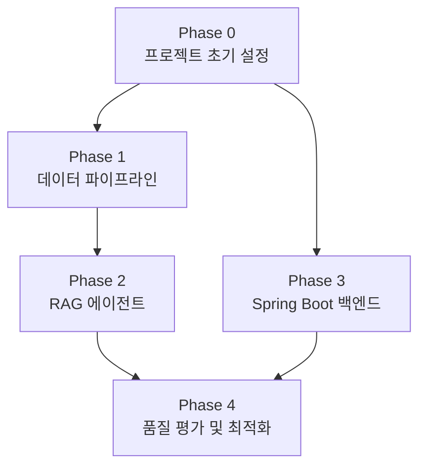

# 작업 명세서 (TASK)

**프로젝트명:** FinSight Agent
**연관 문서:** [PRD.md](./PRD.md) · [TECH_STACK.md](./TECH_STACK.md)

---

## 진행 상태 범례

| 기호 | 의미 |
|---|---|
| `[ ]` | 미시작 |
| `[~]` | 진행 중 |
| `[x]` | 완료 |
| `[!]` | 블로킹 / 보류 |

---

## Phase 0. 프로젝트 초기 설정

> 모든 Phase의 선행 조건. 개발 환경 및 공통 인프라를 구성한다.

### Epic 0-1. 레포지토리 및 디렉토리 구조 설정

- [x] **T-001** GitHub 레포지토리 생성 확인 (main 브랜치 단일 운용)
- [x] **T-002** 모노레포 디렉토리 구조 생성
  ```
  finsight-ai-agent/
  ├── backend/          # Spring Boot
  ├── ai-server/        # FastAPI
  ├── pipeline/         # 수집·정제 스크립트
  ├── docker/           # Dockerfile 모음
  ├── docs/             # PRD, TECH_STACK, TASK
  └── docker-compose.yml
  ```
- [x] **T-003** `.gitignore` 설정 (Java, Python, 환경변수 파일 제외)
- [x] **T-004** `README.md` 초안 작성 (프로젝트 개요, 실행 방법)

### Epic 0-2. 로컬 개발 환경 구성

- [x] **T-005** `docker-compose.yml` 작성 (mysql, chromadb, spring-boot, fastapi 4개 서비스)
- [x] **T-006** `.env.example` 파일 작성 (포트, API Key, DB 패스워드 등 전체 환경변수 목록)
- [x] **T-007** Docker Compose 전체 실행 및 각 서비스 헬스체크 확인

---

## Phase 1. 데이터 파이프라인 구축

> **목표:** 금융 데이터를 자동 수집·정제하여 ChromaDB에 적재하는 파이프라인을 완성한다.

### Epic 1-1. Python 프로젝트 초기화

- [x] **T-101** Poetry 프로젝트 초기화 및 `pyproject.toml` 의존성 정의
- [x] **T-102** 디렉토리 구조 설정
  ```
  ai-server/
  ├── app/
  │   ├── api/          # FastAPI 라우터
  │   ├── agent/        # LangChain RAG 체인
  │   ├── pipeline/     # 수집·정제·벡터화 모듈
  │   └── core/         # 설정, 공통 유틸
  └── tests/
  ```
- [x] **T-103** Ruff, Black 설정 및 pre-commit hook 적용

### Epic 1-2. 데이터 수집 모듈 개발

- [x] **T-104** `FinanceDataReader`로 국내 주가/재무 데이터 수집 모듈 구현
  - KOSPI, KOSDAQ 주요 종목 일별 OHLCV 수집
- [x] **T-105** 금융감독원 OpenDart API 연동 — 기업 공시 수집 모듈 구현
  - API 키 발급 및 환경변수 등록
  - 사업보고서, 주요사항 보고서 수집
- [x] **T-106** Naver Search API 연동 — 국내 금융 뉴스 수집 모듈 구현
  - API 키 발급 및 환경변수 등록
  - 키워드 기반 최신 뉴스 수집 (날짜 필터 포함)
- [x] **T-107** NewsAPI 연동 — 미국 금융 뉴스 수집 모듈 구현
  - API 키 발급 및 환경변수 등록

### Epic 1-3. 데이터 정제 및 구조화 모듈 개발

- [x] **T-108** 수집 데이터 정제 공통 모듈 구현
  - HTML 태그 제거, 중복 뉴스 제거, 빈 본문 필터링
- [x] **T-109** 메타데이터 부착 모듈 구현
  - `source`, `market`, `published_at`, `collected_at`, `category`, `sentiment` 필드 생성
  - 종목 코드 추출 로직 (`related_tickers`)
- [x] **T-110** 정제 결과 JSON 스키마 검증 (Pydantic 모델 정의)

### Epic 1-4. 청킹 및 벡터화 모듈 개발

- [ ] **T-111** ChromaDB 클라이언트 초기화 및 컬렉션 생성
  - `financial_news_kor`, `financial_news_us` 컬렉션
- [ ] **T-112** `RecursiveCharacterTextSplitter` 적용 — 500토큰 / 50 오버랩 청킹 구현
- [ ] **T-113** OpenAI `text-embedding-3-small` 임베딩 모듈 구현
- [ ] **T-114** ChromaDB `upsert` 모듈 구현 (중복 적재 방지, `id` 기반 멱등성 보장)
- [ ] **T-115** 전체 파이프라인 통합 실행 스크립트 작성 (`pipeline/run_pipeline.py`)

### Epic 1-5. GitHub Actions 자동화

- [ ] **T-116** `.github/workflows/daily-pipeline.yml` 작성
  - cron: `30 7 * * 1-5` (평일 16:30 KST)
- [ ] **T-117** GitHub Actions Secrets 등록 (OpenAI Key, DART Key, Naver Key, NewsAPI Key)
- [ ] **T-118** 파이프라인 실패 시 재시도 로직 구현 (최대 2회)
- [ ] **T-119** 파이프라인 완료/실패 Slack 알림 연동
- [ ] **T-120** 파이프라인 수동 실행(`workflow_dispatch`) 및 ChromaDB 정상 적재 검증

---

## Phase 2. RAG 에이전트 구현

> **목표:** 세그먼트별 프롬프트를 분기하고 ChromaDB 검색 결과를 기반으로 인사이트를 생성하는 AI 에이전트를 구현한다.

### Epic 2-1. FastAPI 서버 기반 구성

- [ ] **T-201** FastAPI 앱 초기화 및 라우터 구조 설정
- [ ] **T-202** 요청/응답 Pydantic 스키마 정의
  ```python
  class InsightRequest(BaseModel):
      user_segment: Literal["A", "B", "C"]
      query: str

  class InsightResponse(BaseModel):
      insight: str
      sources: list[str]
  ```
- [ ] **T-203** 내부 서비스 인증 미들웨어 구현 (`X-Internal-Key` 헤더 검증)
- [ ] **T-204** `/health` 엔드포인트 구현 (Docker 헬스체크용)

### Epic 2-2. 세그먼트별 프롬프트 설계

- [ ] **T-205** 프롬프트 템플릿 기반 구조 설계 (LangChain `ChatPromptTemplate`)
- [ ] **T-206** 안전추구형 (A형) 시스템 프롬프트 작성
  - 어조: 보수적, 리스크 강조, 배당·국채 중심
- [ ] **T-207** 위험감수형 (B형) 시스템 프롬프트 작성
  - 어조: 공격적, 기회 강조, 성장주·모멘텀 중심
- [ ] **T-208** 가치투자형 (C형) 시스템 프롬프트 작성
  - 어조: 분석적, 장기 관점, 펀더멘털·실적 중심
- [ ] **T-209** 세그먼트 코드 → 프롬프트 매핑 팩토리 함수 구현

### Epic 2-3. RAG 체인 구현

- [ ] **T-210** ChromaDB Retriever 설정 (날짜·시장 기준 메타데이터 필터 적용)
- [ ] **T-211** LangChain `RetrievalQA` 체인 구성 (Retriever + LLM + 프롬프트)
- [ ] **T-212** `POST /api/ai/insight` 엔드포인트 구현
- [ ] **T-213** LLM 스트리밍 응답 (`StreamingResponse`) 옵션 구현
- [ ] **T-214** 폴백 처리 — ChromaDB 검색 결과 없을 시 전날 데이터 사용 로직

### Epic 2-4. 단위 테스트

- [ ] **T-215** 수집 모듈 단위 테스트 (Mock API 응답 사용)
- [ ] **T-216** 청킹·임베딩 모듈 단위 테스트
- [ ] **T-217** RAG 체인 단위 테스트 (Mock LLM, Mock ChromaDB)
- [ ] **T-218** 프롬프트 분기 로직 단위 테스트 (A/B/C 세그먼트별)

---

## Phase 3. Spring Boot 메인 백엔드 구현

> **목표:** 사용자 인증, 세그먼트 관리, FastAPI 연동 API를 구현하여 클라이언트 요청을 처리한다.

### Epic 3-1. Spring Boot 프로젝트 초기화

- [ ] **T-301** Spring Initializr로 프로젝트 생성 (Java 17, Spring Boot 3.x, Gradle)
  - 의존성: Web, JPA, Security, WebFlux, MySQL Driver, SpringDoc
- [ ] **T-302** 레이어드 아키텍처 패키지 구조 설정
  ```
  backend/src/main/java/com.finsight/
  ├── domain/user/       # Entity, Repository, Service
  ├── domain/insight/
  ├── api/               # Controller, DTO
  ├── infra/ai/          # FastAPI 통신 클라이언트
  └── common/            # 공통 예외, 응답 형식
  ```
- [ ] **T-303** `application.yml` 환경별 프로파일 설정 (`local`, `prod`)
- [ ] **T-304** Checkstyle 설정 적용

### Epic 3-2. 데이터베이스 설계 및 구현

- [ ] **T-305** MySQL DDL 작성 및 JPA Entity 구현
  - `users`, `user_profiles`, `insight_history` 테이블
- [ ] **T-306** `UserRepository`, `UserProfileRepository` 구현 (Spring Data JPA)
- [ ] **T-307** `schema.sql` 또는 Flyway로 DB 마이그레이션 관리

### Epic 3-3. 사용자 인증 구현

- [ ] **T-308** 회원가입 API 구현 (`POST /api/auth/signup`)
  - BCrypt 패스워드 해시 저장
- [ ] **T-309** 로그인 API 구현 (`POST /api/auth/login`)
  - Access Token (30분) + Refresh Token (7일) 발급
- [ ] **T-310** JWT 필터 구현 (`JwtAuthenticationFilter`)
- [ ] **T-311** Refresh Token 재발급 API 구현 (`POST /api/auth/refresh`)
- [ ] **T-312** 사용자 세그먼트 조회·수정 API 구현 (`GET/PUT /api/users/me/profile`)

### Epic 3-4. AI 인사이트 API 구현

- [ ] **T-313** FastAPI 통신 클라이언트 구현 (`AiServerClient`, WebClient 기반)
  - `X-Internal-Key` 헤더 자동 주입, 타임아웃 10초 설정
- [ ] **T-314** 인사이트 요청 API 구현 (`GET /api/insight`)
  - DB에서 사용자 세그먼트 조회 → FastAPI 호출 → 응답 반환
- [ ] **T-315** 인사이트 이력 저장 로직 구현 (`insight_history` 테이블)
- [ ] **T-316** FastAPI 서버 장애 시 폴백 처리 (마지막 캐시 응답 반환)

### Epic 3-5. 통합 테스트

- [ ] **T-317** 회원가입 → 로그인 → 인사이트 요청 전체 플로우 통합 테스트
- [ ] **T-318** MockMvc 기반 Controller 단위 테스트
- [ ] **T-319** `AiServerClient` WireMock 기반 테스트 (FastAPI 모킹)
- [ ] **T-320** Swagger UI에서 전체 API 수동 검증

---

## Phase 4. 품질 평가 및 최적화

> **목표:** 에이전트 답변 품질을 측정하고 파라미터를 튜닝하여 프로덕션 수준으로 개선한다.

### Epic 4-1. AI 에이전트 품질 평가

- [ ] **T-401** 평가용 질문 세트 작성 (세그먼트별 10건, 총 30건)
- [ ] **T-402** Retrieval 품질 측정 — Recall@5 계산 스크립트 작성
- [ ] **T-403** 세그먼트 적합성 정성 평가 — A/B/C 답변 비교 문서 작성
- [ ] **T-404** 환각(Hallucination) 비율 측정 — 청크 근거 없는 문장 수동 검토
- [ ] **T-405** 평가 결과 정리 및 개선 우선순위 도출

### Epic 4-2. 파이프라인·임베딩 최적화

- [ ] **T-406** 청크 크기 파라미터 튜닝 (300 / 500 / 700 토큰 비교)
- [ ] **T-407** 오버랩 비율 튜닝 (25 / 50 / 100 토큰 비교)
- [ ] **T-408** 검색 결과 Top-K 파라미터 튜닝 (3 / 5 / 10 비교)
- [ ] **T-409** 메타데이터 필터 조합 최적화 (날짜, 시장, 카테고리)

### Epic 4-3. 성능 및 안정성 검증

- [ ] **T-410** 인사이트 응답 시간 측정 — P95 < 5초 달성 여부 확인
- [ ] **T-411** 파이프라인 적재 완료 시각 확인 — 16:30 이전 완료 여부
- [ ] **T-412** 파이프라인 실패 시나리오 테스트 — 폴백 동작 확인
- [ ] **T-413** Docker Compose 전체 재시작 후 정상 동작 확인

### Epic 4-4. 문서화 및 마무리

- [ ] **T-414** `README.md` 최종 작성 (아키텍처 다이어그램, 실행 가이드 포함)
- [ ] **T-415** 환경변수 목록 정리 (`.env.example` 최신화)
- [ ] **T-416** 평가 결과 및 최적화 내역 문서화
- [ ] **T-417** 포트폴리오용 프로젝트 설명 초안 작성

---

## 작업 의존성 요약



> Phase 1(파이프라인)과 Phase 3(Spring Boot)는 Phase 0 완료 후 **병렬 진행 가능**.
> Phase 2(RAG 에이전트)는 Phase 1의 ChromaDB 적재 완료 후 시작.
> Phase 4는 Phase 2, 3 모두 완료 후 진행.
