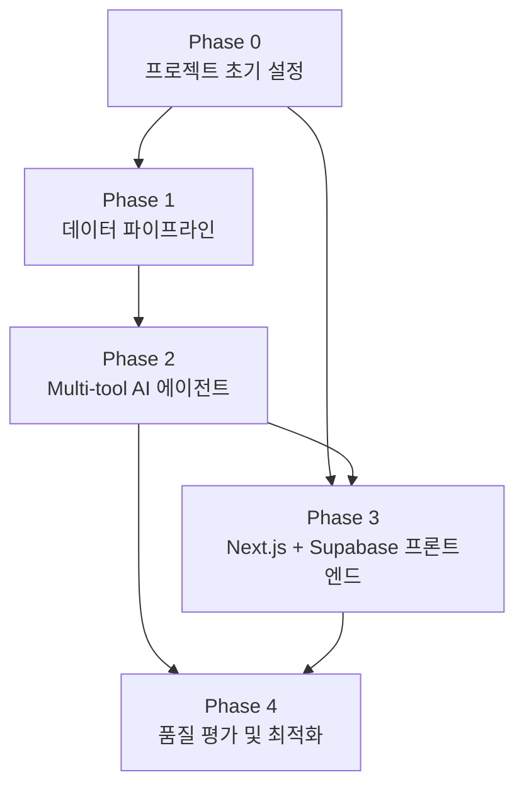

# 작업 명세서 (TASK)

**프로젝트명:** FinSight Agent
**연관 문서:** [PRD.md](./PRD.md) · [TECH_STACK.md](./TECH_STACK.md)

---

## 진행 상태 범례

| 기호 | 의미 |
|---|---|
| `[ ]` | 미시작 |
| `[~]` | 진행 중 |
| `[x]` | 완료 |
| `[!]` | 블로킹 / 보류 |

---

## Phase 0. 프로젝트 초기 설정

> 모든 Phase의 선행 조건. 개발 환경 및 공통 인프라를 구성한다.

### Epic 0-1. 레포지토리 및 디렉토리 구조 설정

- [x] **T-001** GitHub 레포지토리 생성 확인 (main 브랜치 단일 운용)
- [x] **T-002** 모노레포 디렉토리 구조 생성
  ```
  finsight-ai-agent/
  ├── frontend/         # Next.js (App Router, TypeScript)
  ├── ai-server/        # FastAPI
  ├── pipeline/         # 수집·정제 스크립트
  ├── docker/           # Dockerfile 모음
  ├── docs/             # PRD, TECH_STACK, TASK
  └── docker-compose.yml
  ```
- [x] **T-003** `.gitignore` 설정 (Java, Python, 환경변수 파일 제외)
- [x] **T-004** `README.md` 초안 작성 (프로젝트 개요, 실행 방법)

### Epic 0-2. 로컬 개발 환경 구성

- [x] **T-005** `docker-compose.yml` 작성 (fastapi, chromadb 2개 서비스 — EC2 배포용)
- [x] **T-006** `.env.example` 파일 작성 (포트, API Key, DB 패스워드 등 전체 환경변수 목록)
- [x] **T-007** Docker Compose 전체 실행 및 각 서비스 헬스체크 확인

---

## Phase 1. 데이터 파이프라인 구축

> **목표:** 금융 데이터를 자동 수집·정제하여 ChromaDB에 적재하는 파이프라인을 완성한다.

### Epic 1-1. Python 프로젝트 초기화

- [x] **T-101** Poetry 프로젝트 초기화 및 `pyproject.toml` 의존성 정의
- [x] **T-102** 디렉토리 구조 설정
  ```
  ai-server/
  ├── app/
  │   ├── api/          # FastAPI 라우터
  │   ├── agent/        # LangChain RAG 체인
  │   ├── pipeline/     # 수집·정제·벡터화 모듈
  │   └── core/         # 설정, 공통 유틸
  └── tests/
  ```
- [x] **T-103** Ruff, Black 설정 및 pre-commit hook 적용

### Epic 1-2. 데이터 수집 모듈 개발

- [x] **T-104** `FinanceDataReader`로 국내 주가/재무 데이터 수집 모듈 구현
  - KOSPI, KOSDAQ 주요 종목 일별 OHLCV 수집
- [x] **T-105** 금융감독원 OpenDart API 연동 — 기업 공시 수집 모듈 구현
  - API 키 발급 및 환경변수 등록
  - 사업보고서, 주요사항 보고서 수집
- [x] **T-106** Naver Search API 연동 — 국내 금융 뉴스 수집 모듈 구현
  - API 키 발급 및 환경변수 등록
  - 키워드 기반 최신 뉴스 수집 (날짜 필터 포함)
- [x] **T-107** NewsAPI 연동 — 미국 금융 뉴스 수집 모듈 구현
  - API 키 발급 및 환경변수 등록

### Epic 1-3. 데이터 정제 및 구조화 모듈 개발

- [x] **T-108** 수집 데이터 정제 공통 모듈 구현
  - HTML 태그 제거, 중복 뉴스 제거, 빈 본문 필터링
- [x] **T-109** 메타데이터 부착 모듈 구현
  - `source`, `market`, `published_at`, `collected_at`, `category`, `sentiment` 필드 생성
  - 종목 코드 추출 로직 (`related_tickers`)
- [x] **T-110** 정제 결과 JSON 스키마 검증 (Pydantic 모델 정의)

### Epic 1-4. 청킹 및 벡터화 모듈 개발

- [x] **T-111** ChromaDB 클라이언트 초기화 및 컬렉션 생성
  - `financial_news_kor`, `financial_news_us` 컬렉션
- [x] **T-112** `RecursiveCharacterTextSplitter` 적용 — 500토큰 / 50 오버랩 청킹 구현
- [x] **T-113** OpenAI `text-embedding-3-small` 임베딩 모듈 구현
- [x] **T-114** ChromaDB `upsert` 모듈 구현 (중복 적재 방지, `id` 기반 멱등성 보장)
- [x] **T-115** 전체 파이프라인 통합 실행 스크립트 작성 (`pipeline/run_pipeline.py`)

### Epic 1-5. GitHub Actions 자동화

- [x] **T-116** `.github/workflows/daily-pipeline.yml` 작성
  - cron: `30 7 * * 1-5` (평일 16:30 KST)
- [x] **T-117** GitHub Actions Secrets 등록 (OpenAI Key, DART Key, Naver Key, NewsAPI Key)
- [x] **T-118** 파이프라인 실패 시 재시도 로직 구현 (최대 2회)
- [x] **T-119** 파이프라인 완료/실패 Slack 알림 연동
- [!] **T-120** 파이프라인 수동 실행(`workflow_dispatch`) 및 ChromaDB 정상 적재 검증 — EC2 배포 후 실행 필요

### Epic 1-6. 파이프라인 수집 품질 개선

> 단일 쿼리 수집의 편향 문제를 해결하기 위해 시장별 카테고리 쿼리를 세분화하고, 중복 기사 제거 및 메타데이터 카테고리 연동을 구현한다.

- [x] **T-121** 시장별 쿼리 설정 파일 생성 (`query_config.py`)
  - KOR 8개 쿼리: macro, stock_market, semiconductor, exchange_rate, energy, bio_pharma, real_estate, crypto
  - US 6개 쿼리: macro, stock_market, semiconductor, energy, big_tech, crypto (pageSize=15, 일 6건 호출)
- [x] **T-122** 멀티쿼리 수집 래퍼 함수 구현
  - `news_collector.py`: `fetch_naver_news_multi(queries)` — 쿼리 간 `time.sleep(0.5)`
  - `newsapi_collector.py`: `fetch_us_news_multi(queries)` — 쿼리 간 `time.sleep(1.0)`
  - 각 기사에 `category` 필드 부착
- [x] **T-123** URL 기반 중복 제거 유틸리티 구현 (`dedup.py`)
  - KOR: `link` 필드 기준, US: `url` 필드 기준
  - 먼저 수집된 카테고리 우선 보존
- [x] **T-124** 메타데이터 카테고리 동적 반영 (`metadata_builder.py`)
  - `category: "general"` 하드코딩 → item의 `category` 필드 참조로 변경
- [x] **T-125** `run_pipeline.py` 통합 수정
  - 단일 쿼리 제거 → 멀티쿼리 수집 + 중복 제거 적용
  - stats에 `deduplicated` 카운터 추가
- [x] **T-126** 신규 모듈 단위 테스트 작성 (dedup, query_config, multi-fetch)

---

## Phase 2. Multi-tool AI 에이전트 구현

> **목표:** 단순 RAG 체인을 넘어 LangChain AgentExecutor 기반 Multi-tool 구조로 전환한다. Agent가 질문 유형에 따라 뉴스 검색 / DART 공시 조회 / 가격 이상 감지 도구를 스스로 선택·조합하고, 세그먼트별 검색 전략과 프롬프트를 동시에 분기하여 개인화된 인사이트를 생성한다.

### Epic 2-1. FastAPI 서버 기반 구성

- [x] **T-201** FastAPI 앱 초기화 및 라우터 구조 설정
- [x] **T-202** 요청/응답 Pydantic 스키마 정의
  ```python
  class InsightRequest(BaseModel):
      user_segment: Literal["A", "B", "C"]
      query: str

  class InsightResponse(BaseModel):
      insight: str
      sources: list[str]
  ```
- [x] **T-203** 내부 서비스 인증 미들웨어 구현 (`X-Internal-Key` 헤더 검증)
- [x] **T-204** `/health` 엔드포인트 구현 (Docker 헬스체크용)

### Epic 2-2. 세그먼트별 프롬프트 설계

- [x] **T-205** 프롬프트 템플릿 기반 구조 설계 (LangChain `ChatPromptTemplate`)
- [x] **T-206** 안전추구형 (A형) 시스템 프롬프트 작성
  - 어조: 보수적, 리스크 강조, 배당·국채 중심
- [x] **T-207** 위험감수형 (B형) 시스템 프롬프트 작성
  - 어조: 공격적, 기회 강조, 성장주·모멘텀 중심
- [x] **T-208** 가치투자형 (C형) 시스템 프롬프트 작성
  - 어조: 분석적, 장기 관점, 펀더멘털·실적 중심
- [x] **T-209** 세그먼트 코드 → 프롬프트 매핑 팩토리 함수 구현

### Epic 2-3. RAG 체인 구현

- [x] **T-210** ChromaDB Retriever 설정 (날짜·시장 기준 메타데이터 필터 적용)
- [x] **T-211** LangChain LCEL 체인 구성 (Retriever + LLM + 프롬프트)
- [x] **T-212** `POST /api/ai/insight` 엔드포인트 구현
- [x] **T-213** LLM 스트리밍 응답 (`POST /api/ai/insight/stream`) 구현
- [x] **T-214** 폴백 처리 — 검색 결과 없을 시 안내 메시지 반환

### Epic 2-4. 단위 테스트

- [x] **T-215** 수집 모듈 단위 테스트 (Mock API 응답 사용)
- [x] **T-216** 청킹·임베딩 모듈 단위 테스트
- [x] **T-217** RAG 체인 단위 테스트 (Mock LLM, Mock ChromaDB)
- [x] **T-218** 프롬프트 분기 로직 단위 테스트 (A/B/C 세그먼트별)

### Epic 2-5. Multi-tool Agent 전환

> 기존 LCEL RAG 체인을 LangChain AgentExecutor 기반 Multi-tool 구조로 전환한다.

- [ ] **T-219** LangChain AgentExecutor 기반 구조 설계
  - `create_openai_tools_agent` 사용 (Tool-calling 방식)
  - 기존 LCEL 체인 → Agent + Tools 구조로 리팩터링
  - `agent/tools.py`, `agent/executor.py` 모듈 분리
- [ ] **T-220** `search_news_tool` 구현
  - ChromaDB RAG 검색 도구 (기존 Retriever 래핑)
  - 세그먼트별 메타데이터 필터 동적 적용 (category, market)
  - 도구 설명(docstring)으로 Agent에 사용 시점 명시
- [ ] **T-221** `get_dart_tool` 구현
  - DART OpenAPI `/api/list.json` 연동 (최근 30일 공시 목록)
  - 종목코드 → corp_code 변환 매핑 (`dart_corp_map.py`)
  - 핵심 공시 유형 필터: 분기보고서, 대규모내부거래, 임원변동
- [ ] **T-222** `get_price_tool` 구현
  - Yahoo Finance 온디맨드 조회 (FastAPI 내부에서 직접 호출)
  - 종가, 등락률, 거래량, 52주 최고/최저 반환
- [ ] **T-223** `price_anomaly_tool` 구현
  - FinanceDataReader로 최근 20일 일별 수익률 조회
  - Z-score 산출: `(오늘 등락률 - 평균) / 표준편차`
  - |Z-score| > 2 → 이상 감지, 결과를 Agent 컨텍스트에 전달
- [ ] **T-224** 세그먼트별 Agent 프롬프트 재설계
  - 기존 RAG 프롬프트 → Agent 시스템 프롬프트로 전환
  - A형: 리스크·배당 도구 우선 / B형: 가격·모멘텀 우선 / C형: 공시·실적 우선
  - 답변 하단 비투자권유 고지문 삽입
- [ ] **T-225** Agent 스트리밍 응답 수정
  - `AgentExecutor.astream_events()` 사용
  - 도구 호출 중간 단계도 SSE로 전달 (선택)
  - 최종 답변 + 사용된 도구 목록(sources) 반환

### Epic 2-6. 가격 이상 감지 프론트엔드 연동

- [ ] **T-226** 홈 화면 이상 감지 배지 표시
  - 관심종목 카드에서 |Z-score| > 2 종목에 `⚡ 급변동` 배지 표시
  - 배지 클릭 시 해당 종목 인사이트 페이지로 이동
- [ ] **T-227** 인사이트 페이지 이상 감지 자동 트리거
  - 페이지 진입 시 price_anomaly_tool 결과 자동 표시
  - "오늘 이 종목 변동이 비정상적입니다 (Z-score: 3.1)" 안내 카드

---

## Phase 3. Next.js + Supabase 프론트엔드 구현

> **목표:** 관심 종목 등록·검색, 종목별 AI 인사이트(RAG), 세그먼트 기반 개인화를 갖춘 모바일 퍼스트 웹앱을 구현하고 Vercel에 배포한다.

### Epic 3-1. 프로젝트 초기화 및 환경 설정

- [x] **T-301** Next.js 14 프로젝트 생성 (App Router, TypeScript, Tailwind CSS)
- [x] **T-302** Supabase 프로젝트 생성 및 환경변수 설정 (.env.local)
- [x] **T-303** Supabase 테이블 스키마 생성
  - `profiles` (user_id, segment, created_at)
  - `watchlist` (user_id, ticker, name, market, added_at)
  - `stocks` (ticker, name, market — KRX + S&P500 종목 목록)
  - `daily_prices` (ticker, date, close, change_pct — 파이프라인 적재)
  - `insight_history` (user_id, ticker, query, answer, sources, created_at)
- [ ] **T-304** Vercel 프로젝트 연결 및 환경변수 등록

### Epic 3-2. 인증 구현

- [x] **T-305** Supabase 클라이언트 유틸 설정 (lib/supabase/)
  - `client.ts` (브라우저용), `server.ts` (서버 컴포넌트용)
- [x] **T-306** 로그인/회원가입 페이지 구현 (/login) — 슬라이드업 모달 회원가입
- [x] **T-307** 세그먼트 선택 온보딩 구현 (/onboarding — 최초 로그인 시)
- [x] **T-308** 미들웨어 기반 인증 라우트 보호 (middleware.ts)

### Epic 3-3. 관심 종목 기능 구현

- [x] **T-309** 종목 검색 API Route 구현 (`/api/stocks/search`)
  - Supabase `stocks` 테이블 ILIKE 쿼리
- [x] **T-310** 종목 검색 페이지 구현 (/search)
  - 실시간 검색 + 국내/해외 구분 결과
  - 관심 종목 추가/제거
- [x] **T-311** 홈 페이지 구현 (/)
  - 관심 종목 카드 목록 (Yahoo Finance 실시간 종가 + 등락률)
  - 오늘의 시장 요약 배너 (Yahoo Finance 실시간: KOSPI, NASDAQ, 원/달러)
- [x] **T-312** Yahoo Finance 실시간 가격 연동 (`lib/yahoo.ts`)
  - `fetchPrice` / `fetchPrices` / `fetchMarketSummary` 구현
  - KOSPI `.KS`, KOSDAQ `.KQ` 티커 변환, `next.revalidate` 캐시 적용
- [ ] **T-312b** 관심 종목 CRUD API Route (`/api/watchlist`)

### Epic 3-4. 인사이트 화면 구현

- [x] **T-313** FastAPI 프록시 API Route (`/api/insight`)
  - watchlist 종목 ticker → ChromaDB `related_tickers` 필터
  - Supabase 세그먼트 조회 → FastAPI POST
- [x] **T-314** 종목 인사이트 페이지 구현 (/insight/[ticker])
  - 종목 가격 카드 (Yahoo Finance 실시간 종가, 등락률)
  - RAG 인사이트 스트리밍 출력
  - 출처 뉴스 칩
  - 추가 질문 입력창
- [x] **T-315** 세그먼트별 UI 테마 분기 (A: 파랑, B: 빨강, C: 초록)
- [x] **T-316** 인사이트 이력 저장 (insight_history 테이블)

### Epic 3-5. 이력 및 설정 화면

- [x] **T-317** 이력 페이지 구현 (/history) — 날짜별 인사이트 목록
- [x] **T-318** 설정 페이지 구현 (/settings) — 세그먼트 변경, 종목 관리, 로그아웃

### Epic 3-6. 배포

- [ ] **T-319** Vercel 배포 및 도메인 연결
- [ ] **T-320** FastAPI EC2 CORS 설정 (Vercel 도메인 허용)
- [ ] **T-321** E2E 배포 검증 (로그인 → 종목 등록 → 인사이트 생성 전체 플로우)

---

## Phase 4. 품질 평가 및 최적화

> **목표:** Multi-tool Agent의 도구 선택 정확도·Retrieval 품질을 측정하고, 파라미터 튜닝 및 포트폴리오 문서화를 완료한다.

### Epic 4-1. Agent 품질 평가

- [ ] **T-401** 평가용 질문 세트 작성 (세그먼트별 10건, 총 30건)
  - 도구 선택 유형별 분류: 뉴스형 / 공시형 / 가격형 / 복합형
- [ ] **T-402** Retrieval 품질 측정 — Recall@5 계산 스크립트 작성
  - 질문-정답 청크 쌍 수동 레이블링 후 자동 측정
- [ ] **T-403** 도구 선택 정확도 평가
  - 30건 질문에 대해 실제 호출된 도구 vs. 기대 도구 비교 (수동)
  - 목표: ≥ 85% 일치율
- [ ] **T-404** 세그먼트 적합성 정성 평가
  - 동일 질문에 대해 A/B/C 세그먼트 답변 비교 문서 작성
  - 관점·어조·강조점 차이 확인
- [ ] **T-405** 환각(Hallucination) 비율 측정
  - 청크 근거 없는 수치·사실 포함 비율 측정 (목표 ≤ 10%)
- [ ] **T-406** 평가 결과 정리 및 개선 우선순위 도출 (`docs/eval_results.md`)

### Epic 4-2. 파이프라인·임베딩 최적화

- [ ] **T-407** 청크 크기 파라미터 튜닝 (300 / 500 / 700 토큰 비교)
- [ ] **T-408** 오버랩 비율 튜닝 (25 / 50 / 100 토큰 비교)
- [ ] **T-409** 검색 결과 Top-K 파라미터 튜닝 (3 / 5 / 10 비교)
- [ ] **T-410** 세그먼트별 메타데이터 필터 조합 최적화

### Epic 4-3. 성능 및 안정성 검증

- [ ] **T-411** 인사이트 응답 시간 측정 — P95 < 5초 달성 여부 확인
- [ ] **T-412** 파이프라인 적재 완료 시각 확인 — 16:30 이전 완료 여부
- [ ] **T-413** 파이프라인 실패 시나리오 테스트 — 폴백 동작 확인
- [ ] **T-414** Docker Compose 전체 재시작 후 정상 동작 확인

### Epic 4-4. 문서화 및 포트폴리오 마무리

- [ ] **T-415** `README.md` 최종 작성
  - 프로젝트 개요, 아키텍처 다이어그램, 실행 가이드
  - "GPT 래퍼와의 차별점" 섹션 명시
- [ ] **T-416** 환경변수 목록 정리 (`.env.example` 최신화)
- [ ] **T-417** 평가 결과 및 최적화 내역 문서화 (`docs/eval_results.md`)
- [ ] **T-418** 포트폴리오 어필 포인트 문서 작성 (`docs/PORTFOLIO.md`)
  - 기술적 의사결정 근거 (왜 AgentExecutor인가, 왜 Multi-tool인가)
  - 금융 도메인 특화 설계 (면책 고지, 세그먼트 기반 검색 분기)
  - 수치 결과 (Recall@5, 도구 선택 정확도, P95 응답시간)

---

## 작업 의존성 요약



> Phase 1(파이프라인)과 Phase 3(프론트엔드)는 Phase 0 완료 후 **병렬 진행 가능**.
> Phase 2(Multi-tool Agent)는 Phase 1 ChromaDB 적재 완료 후 시작.
> Phase 3 Epic 2-6(이상 감지 UI)은 Phase 2 Epic 2-5 완료 후 진행.
> Phase 4는 Phase 2, 3 모두 완료 후 진행.
