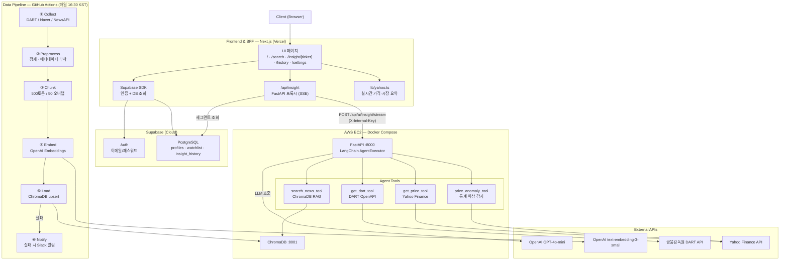
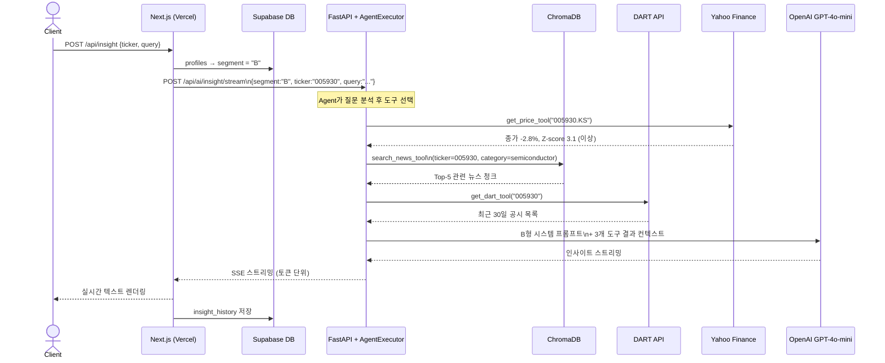
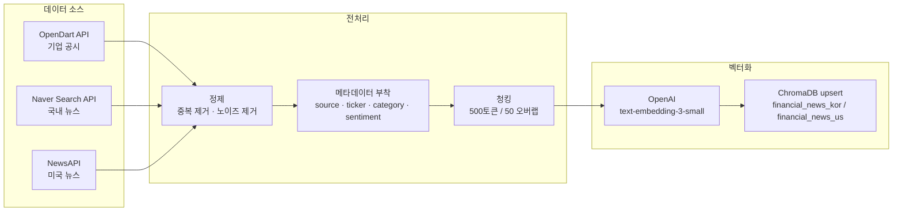
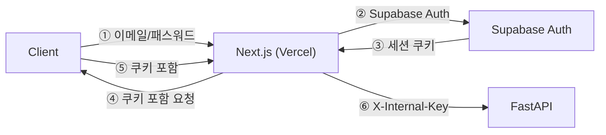

# 기술 스택 명세서 (Tech Stack)

**프로젝트명:** FinSight Agent
**연관 문서:** [PRD.md](./PRD.md)

---

## 전체 시스템 아키텍처



---

## Multi-tool Agent 요청 시퀀스



---

## 데이터 파이프라인 흐름



---

## 1. Frontend & BFF — Next.js

| 항목 | 기술 | 버전 | 선택 근거 |
|---|---|---|---|
| Language | TypeScript | 5.x | 정적 타입, 코드베이스 안전성 |
| Framework | Next.js | 14 (App Router) | SSR + API Route로 BFF 역할 겸임 |
| 인증 | Supabase Auth | - | 이메일/패스워드, 세션 쿠키 관리 내장 |
| Database Client | Supabase SDK | 2.x | profiles · watchlist · insight_history CRUD |
| 실시간 가격 | Yahoo Finance API | - | 종목 가격·시장 요약 온디맨드 조회, next.revalidate 캐시 |
| 스타일링 | Tailwind CSS | 3.x | 세그먼트별 테마 분기 용이 |
| 배포 | Vercel | - | Next.js 최적화 플랫폼, 자동 CI/CD |
| 라우트 보호 | Next.js middleware.ts | - | 미인증 사용자 /login 리다이렉트 |

```typescript
// lib/yahoo.ts — 실시간 가격 조회
export async function fetchPrice(ticker: string, market: string): Promise<PriceData | null>
export async function fetchMarketSummary(): Promise<MarketSummary>
// ^KS11(KOSPI), ^IXIC(NASDAQ), KRW=X(환율) — revalidate: 1800s

// /api/insight/route.ts — FastAPI 프록시 (SSE passthrough)
export async function POST(req: Request) {
  const { data: profile } = await supabase.from('profiles').select('segment')...
  const upstream = await fetch(`${FASTAPI_URL}/api/ai/insight/stream`, {
    headers: { 'X-Internal-Key': INTERNAL_API_KEY },
    body: JSON.stringify({ user_segment: profile.segment, ticker, query }),
  })
  return new Response(upstream.body, { headers: { 'Content-Type': 'text/event-stream' } })
}
```

---

## 2. AI & Data Backend — FastAPI + LangChain Agent

| 항목 | 기술 | 버전 | 선택 근거 |
|---|---|---|---|
| Language | Python | 3.11+ | 최신 LTS, 타입 힌트 강화 |
| Framework | FastAPI | 0.110+ | 비동기 네이티브, Pydantic 통합, 자동 OpenAPI |
| AI Orchestration | LangChain AgentExecutor | 0.3+ | 도구 선택·실행·결과 종합 루프 구현 표준 |
| LLM | OpenAI GPT-4o-mini | - | 비용 효율적, 빠른 응답, Tool-calling 지원 |
| Embedding | OpenAI text-embedding-3-small | - | ada-002 대비 5배 저렴, 성능 동등, 1536차원 |
| Vector DB | ChromaDB | 1.0+ | 로컬/서버 모드, 메타데이터 필터, 무료 |
| 데이터 검증 | Pydantic | v2 | 요청/응답 스키마 자동 검증 |
| HTTP 서버 | Uvicorn | - | ASGI 고성능 서버 |
| 패키지 관리 | Poetry | - | 의존성 락파일 관리 |

```python
# agent/tools.py — 4개 도구 정의

@tool
def search_news_tool(query: str, market: str = "KOR") -> str:
    """뉴스·공시 ChromaDB에서 관련 청크를 검색합니다."""
    results = chroma_retriever.get_relevant_documents(query, where={"market": market})
    return format_chunks(results)

@tool
def get_dart_tool(corp_code: str) -> str:
    """DART API에서 최근 30일 기업 공시를 조회합니다."""
    resp = requests.get(DART_URL, params={"corp_code": corp_code, ...})
    return format_disclosures(resp.json())

@tool
def get_price_tool(ticker: str) -> str:
    """Yahoo Finance에서 현재 종가·등락률·거래량을 조회합니다."""
    data = fetch_yahoo(ticker)
    return f"현재가: {data['close']}, 등락률: {data['change_pct']}%"

@tool
def price_anomaly_tool(ticker: str) -> str:
    """최근 20일 기준 Z-score로 오늘 가격 이상 여부를 판단합니다."""
    z_score = calculate_zscore(ticker)
    return f"Z-score: {z_score:.2f} ({'이상' if abs(z_score) > 2 else '정상'})"

# agent/executor.py
agent = create_openai_tools_agent(llm, tools=[
    search_news_tool, get_dart_tool, get_price_tool, price_anomaly_tool
], prompt=segment_prompt)
executor = AgentExecutor(agent=agent, tools=tools, verbose=True)
```

---

## 3. Data Pipeline — 수집 및 전처리

| 항목 | 기술 | 선택 근거 |
|---|---|---|
| 스케줄러 | GitHub Actions (cron) | 별도 서버 불필요, CI/CD와 통합 관리 |
| 국내 공시 | 금융감독원 OpenDart API | 사업보고서, 분기보고서, 주요사항 보고서 수집 |
| 국내 뉴스 | Naver Search API | 카테고리별 멀티쿼리(8개) 실시간 금융 뉴스 |
| 미국 뉴스 | NewsAPI | 카테고리별 멀티쿼리(6개) 영문 금융 뉴스 |
| 데이터 처리 | pandas 2.x | 주가 데이터 정제 및 변환 |
| 텍스트 분할 | LangChain RecursiveCharacterTextSplitter | 500토큰 / 50 오버랩 |
| 중복 제거 | URL 기반 dedup.py | 먼저 수집된 카테고리 우선 보존 |

---

## 4. 데이터베이스

### Supabase PostgreSQL

| 테이블 | 주요 컬럼 | 용도 |
|---|---|---|
| `profiles` | user_id(UUID PK), segment(A/B/C) | 사용자 투자 성향 |
| `stocks` | ticker(PK), name, market | KRX + S&P500 종목 목록 |
| `watchlist` | user_id + ticker(unique), name, market | 관심종목 |
| `insight_history` | id(UUID), user_id, ticker, query, answer, sources[] | 인사이트 이력 |

```sql
-- 모든 테이블 RLS 활성화
-- profiles: 본인 데이터만 read/write
-- watchlist: 본인 데이터만 read/write
-- stocks: 전체 공개 (select policy: true)
-- insight_history: 본인 데이터만 read/write
```

### ChromaDB — Vector DB

| 컬렉션명 | 설명 |
|---|---|
| `financial_news_kor` | 국내 뉴스 + DART 공시 청크 |
| `financial_news_us` | 미국 뉴스 청크 |

```json
// 메타데이터 필터 예시 (세그먼트별 검색 전략)
// A형: {"category": {"$in": ["dividend", "macro"]}, "sentiment": "negative"}
// B형: {"category": {"$in": ["semiconductor", "big_tech"]}, "market": "KOR"}
// C형: {"source": {"$in": ["dart", "newsapi"]}, "category": "earnings"}
```

---

## 5. 인증 및 보안



| 항목 | 방식 | 비고 |
|---|---|---|
| 사용자 인증 | Supabase Auth (이메일/패스워드) | 세션 쿠키, Supabase 관리형 |
| 내부 서비스 | Internal API Key (`X-Internal-Key`) | Next.js ↔ FastAPI 인증 |
| 민감 정보 | Vercel 환경변수 / GitHub Secrets | OpenAI Key, Supabase Key 등 |
| 라우트 보호 | Next.js middleware.ts | 미인증 자동 리다이렉트 |

---

## 6. 개발 환경 및 인프라

| 항목 | 기술 | 비고 |
|---|---|---|
| 컨테이너화 | Docker + Docker Compose | EC2 FastAPI + ChromaDB 실행 |
| 버전 관리 | Git + GitHub | main 브랜치 단일 운용 |
| CI/CD | GitHub Actions | 데이터 파이프라인 자동화 (평일 16:30) |
| Frontend 배포 | Vercel | Next.js 자동 빌드 및 배포 |
| API 문서 | FastAPI Swagger UI (`/docs`) | 도구별 스키마 자동 생성 |
| 코드 품질 (Python) | Ruff + pre-commit | 빌드 전 자동 검사 |
| 코드 품질 (TS) | ESLint + TypeScript strict | Next.js 빌드 시 타입 검사 |

```yaml
# docker-compose.yml (로컬/EC2 공용)
services:
  chromadb:   # port 8001
  fastapi:    # port 8000, depends_on: chromadb
```

---

## 7. 기술 선택 요약 및 근거

| 레이어 | 선택 기술 | 대안 | 선택 근거 |
|---|---|---|---|
| Frontend & BFF | Next.js (Vercel) | Remix, SvelteKit | App Router + API Route BFF 겸임, Vercel 최적화 |
| 인증 / DB | Supabase | Firebase, PlanetScale | PostgreSQL + Auth + RLS 통합, 무료 티어 충분 |
| AI Backend | FastAPI | Flask, Django | 비동기 네이티브, Pydantic 자동 검증 |
| AI Agent | LangChain AgentExecutor | LlamaIndex, 직접 구현 | Tool-calling 표준, LCEL 체인과 통합 용이 |
| Vector DB | ChromaDB | Pinecone, Weaviate | 로컬 실행, 무료, 메타데이터 필터 지원 |
| Embedding | text-embedding-3-small | ada-002 | 비용 5배 절감, 성능 동등 |
| LLM | GPT-4o-mini | GPT-4o, Claude 3.5 | Tool-calling 지원, 비용 효율 |
| 실시간 가격 | Yahoo Finance API | KIS API, Alpha Vantage | 별도 계약 불필요, 국내·해외 통합 지원 |
| Pipeline | GitHub Actions | Airflow, Prefect | 별도 인프라 불필요, 프로젝트 규모 적합 |
