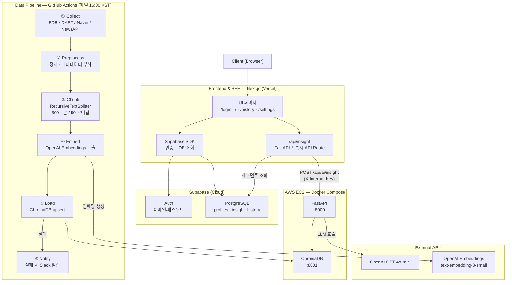
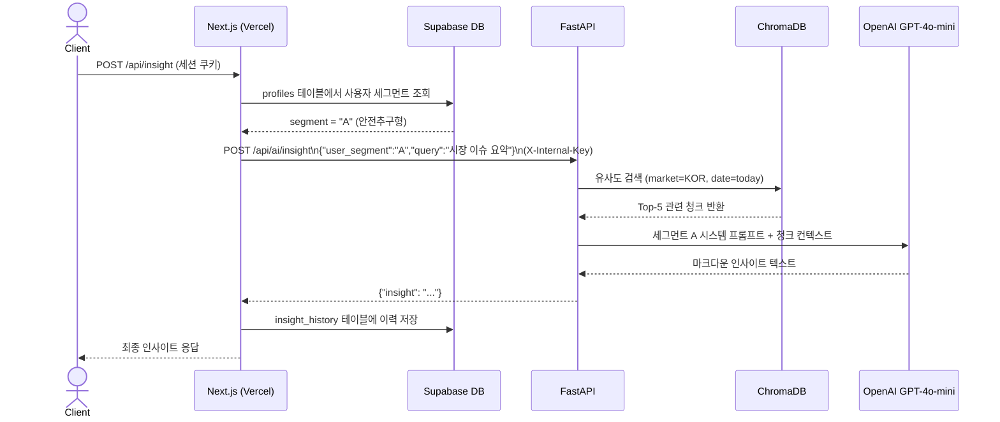
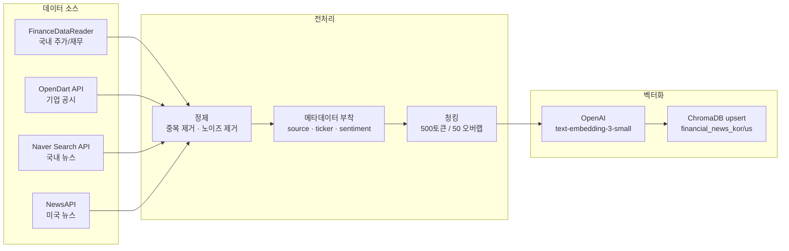
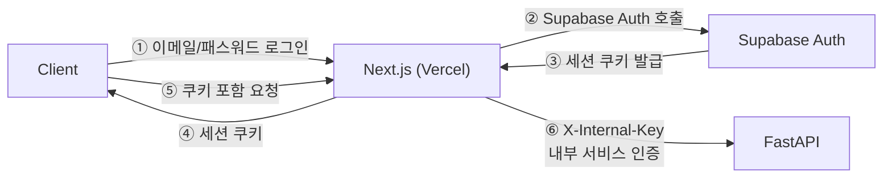

# 기술 스택 명세서 (Tech Stack)

**프로젝트명:** FinSight Agent
**연관 문서:** [PRD.md](./PRD.md)

---

## 전체 시스템 아키텍처



---

## 인사이트 요청 시퀀스



---

## 데이터 파이프라인 흐름



---

## 1. Frontend & BFF — Next.js

| 항목 | 기술 | 버전 | 선택 근거 |
|---|---|---|---|
| Language | TypeScript | 5.x | 정적 타입, 대규모 코드베이스 안전성 |
| Framework | Next.js | 14 (App Router) | SSR/SSG 지원, API Route로 BFF 역할 겸임 |
| 인증 | Supabase Auth | - | 이메일/패스워드 인증, 세션 관리 내장 |
| Database Client | Supabase SDK | 2.x | profiles · insight_history 테이블 CRUD |
| 스타일링 | Tailwind CSS | 3.x | 빠른 UI 개발, 세그먼트별 테마 분기 용이 |
| 배포 | Vercel | - | Next.js 최적화 플랫폼, 자동 CI/CD |
| 라우트 보호 | Next.js middleware.ts | - | 미인증 사용자 /login 리다이렉트 |

```typescript
// Supabase 테이블 스키마
// profiles
// - user_id  UUID  FK → auth.users (PK)
// - segment  TEXT  'A' | 'B' | 'C'
// - created_at TIMESTAMPTZ

// insight_history
// - id         UUID  PK (gen_random_uuid())
// - user_id    UUID  FK → auth.users
// - query      TEXT
// - response   TEXT
// - created_at TIMESTAMPTZ
```

```typescript
// /api/insight/route.ts  (Next.js API Route)
import { createServerClient } from '@supabase/ssr'

export async function POST(req: Request) {
  const supabase = createServerClient(...)
  const { data: { user } } = await supabase.auth.getUser()
  const { data: profile } = await supabase
    .from('profiles')
    .select('segment')
    .eq('user_id', user.id)
    .single()

  const res = await fetch(`${process.env.FASTAPI_URL}/api/ai/insight`, {
    method: 'POST',
    headers: {
      'Content-Type': 'application/json',
      'X-Internal-Key': process.env.INTERNAL_API_KEY!,
    },
    body: JSON.stringify({ user_segment: profile.segment, query: ... }),
  })
  return Response.json(await res.json())
}
```

---

## 2. AI & Data Backend — FastAPI

| 항목 | 기술 | 버전 | 선택 근거 |
|---|---|---|---|
| Language | Python | 3.11+ | 최신 LTS, 성능 개선 및 타입 힌트 강화 |
| Framework | FastAPI | 0.110+ | 비동기 네이티브, 자동 OpenAPI 문서, Pydantic 통합 |
| AI Orchestration | LangChain | 0.2+ | RAG 체인, 프롬프트 템플릿, 에이전트 구성 표준 |
| LLM | OpenAI GPT-4o-mini | - | 비용 효율적, 빠른 응답, 금융 텍스트 생성 충분 |
| Embedding | OpenAI text-embedding-3-small | - | ada-002 대비 약 5배 저렴, 성능 동등, 1536차원 |
| Vector DB | ChromaDB | 0.5+ | 로컬/서버 모드, 메타데이터 필터링 지원, 무료 |
| 데이터 검증 | Pydantic | v2 | 요청/응답 스키마 자동 검증 |
| HTTP 서버 | Uvicorn | - | ASGI 고성능 서버 |
| 패키지 관리 | Poetry | - | 의존성 락파일 관리, 가상환경 격리 |

```toml
# pyproject.toml
[tool.poetry.dependencies]
python = "^3.11"
fastapi = "^0.110"
uvicorn = {extras = ["standard"], version = "^0.29"}
langchain = "^0.2"
langchain-openai = "^0.1"
langchain-chroma = "^0.1"
chromadb = "^0.5"
pydantic = "^2.0"
httpx = "^0.27"
```

---

## 3. Data Pipeline — 수집 및 전처리

| 항목 | 기술 | 선택 근거 |
|---|---|---|
| 스케줄러 | GitHub Actions (cron) | 별도 서버 불필요, CI/CD와 통합 관리 |
| 국내 주가/재무 | FinanceDataReader 0.9+ | KRX, KOSPI/KOSDAQ 데이터 무료 수집 |
| 국내 공시 | 금융감독원 OpenDart API | 사업보고서, 분기보고서 구조화 수집 |
| 국내 뉴스 | Naver Search API | 실시간 금융 뉴스 수집 |
| 미국 뉴스 | NewsAPI | 영문 금융 뉴스 수집 |
| 데이터 처리 | pandas 2.x | 주가 데이터 정제 및 변환 |
| HTTP 요청 | httpx | 비동기 API 호출 |
| 텍스트 분할 | LangChain RecursiveCharacterTextSplitter | 500토큰 / 50 오버랩, 문장 단위 경계 |

```yaml
# .github/workflows/daily-pipeline.yml
name: Daily Financial Data Pipeline
on:
  schedule:
    - cron: '30 7 * * 1-5'  # 평일 16:30 KST (UTC+9)

jobs:
  pipeline:
    steps:
      - name: Collect     # DART, Naver API, NewsAPI, FDR 수집
      - name: Preprocess  # 정제, 메타데이터 부착, JSON 구조화
      - name: Embed       # OpenAI Embedding API 호출
      - name: Load        # ChromaDB upsert
      - name: Notify      # 실패 시 Slack 알림 (최대 2회 재시도)
```

---

## 4. 데이터베이스

### Supabase PostgreSQL — 관계형 DB (Next.js)

| 테이블 | 주요 컬럼 | 용도 |
|---|---|---|
| `profiles` | user_id(UUID, FK→auth.users), segment(A/B/C), created_at | 사용자 투자 성향 세그먼트 |
| `insight_history` | id(UUID), user_id, query, response, created_at | AI 인사이트 요청/응답 이력 |

```sql
-- profiles
create table profiles (
  user_id uuid primary key references auth.users(id) on delete cascade,
  segment text not null check (segment in ('A', 'B', 'C')),
  created_at timestamptz default now()
);

-- insight_history
create table insight_history (
  id uuid primary key default gen_random_uuid(),
  user_id uuid references auth.users(id) on delete cascade,
  query text not null,
  response text not null,
  created_at timestamptz default now()
);

-- RLS 활성화
alter table profiles enable row level security;
alter table insight_history enable row level security;
```

### ChromaDB — Vector DB (FastAPI)

| 컬렉션명 | 설명 |
|---|---|
| `financial_news_kor` | 국내 뉴스 및 공시 청크 |
| `financial_news_us` | 미국 뉴스 청크 |

```json
// 청크 메타데이터 스키마
{
  "source": "naver_news | dart | newsapi",
  "published_at": "2025-03-10T14:30:00",
  "collected_at": "2025-03-10T16:35:00",
  "market": "KOR | US",
  "related_tickers": ["005930", "000660"],
  "category": "semiconductor | finance | energy",
  "sentiment": "positive | negative | neutral"
}
```

---

## 5. 인증 및 보안



| 항목 | 방식 | 비고 |
|---|---|---|
| 사용자 인증 | Supabase Auth (이메일/패스워드) | 세션 쿠키 기반, Supabase 관리형 |
| 내부 서비스 통신 | Internal API Key (`X-Internal-Key` 헤더) | Next.js API Route ↔ FastAPI 인증 |
| 민감 정보 관리 | Vercel 환경변수 / GitHub Actions Secrets | OpenAI API Key, Supabase Service Role Key 등 |
| 라우트 보호 | Next.js `middleware.ts` | 미인증 사용자 자동 리다이렉트 |

---

## 6. 개발 환경 및 인프라

| 항목 | 기술 | 비고 |
|---|---|---|
| 컨테이너화 | Docker + Docker Compose | EC2 FastAPI + ChromaDB 실행 |
| 버전 관리 | Git + GitHub | PR 기반 코드 리뷰 |
| CI/CD | GitHub Actions | 데이터 파이프라인 자동화 |
| Frontend 배포 | Vercel | Next.js 자동 빌드 및 배포 |
| API 테스트 | Postman / Swagger UI (FastAPI) | 수동 검증 |
| 코드 품질 (Python) | Ruff (Linter), Black (Formatter) | pre-commit hook 적용 |
| 코드 품질 (TS) | ESLint + Prettier | Next.js 기본 설정 |

```yaml
# docker-compose.yml 서비스 구성 (EC2)
services:
  fastapi:      # port 8000  depends_on: chromadb
  chromadb:     # port 8001
```

---

## 7. 기술 선택 요약 및 근거

| 레이어 | 선택 기술 | 대안 | 선택 근거 |
|---|---|---|---|
| Frontend & BFF | Next.js (Vercel) | Remix, SvelteKit | App Router + API Route로 BFF 겸임, Vercel 배포 최적화 |
| 인증 / DB | Supabase | Firebase, PlanetScale | PostgreSQL + Auth + RLS 통합, 무료 티어 충분 |
| AI Backend | FastAPI | Flask, Django | 비동기 네이티브, Pydantic 자동 검증, LangChain과 궁합 |
| Vector DB | ChromaDB | Pinecone, Weaviate | 로컬 실행 가능, 무료, 메타데이터 필터 지원 |
| Embedding | text-embedding-3-small | text-embedding-ada-002 | 비용 5배 절감, 성능 동등 |
| LLM | GPT-4o-mini | GPT-4o, Claude 3.5 Sonnet | 비용 효율적, RAG 기반이므로 컨텍스트 보완 가능 |
| Pipeline | GitHub Actions | Airflow, Prefect | 별도 인프라 불필요, 프로젝트 규모에 적합 |
