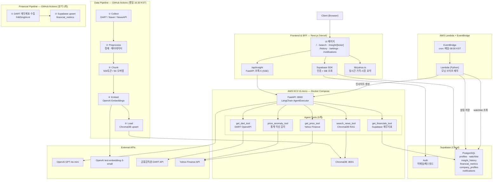
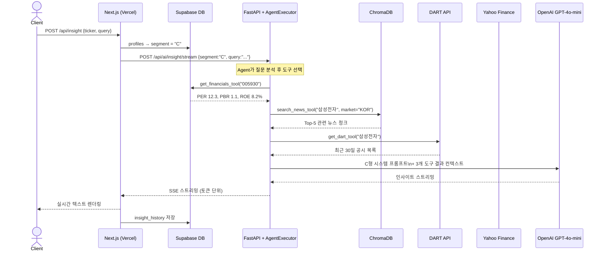
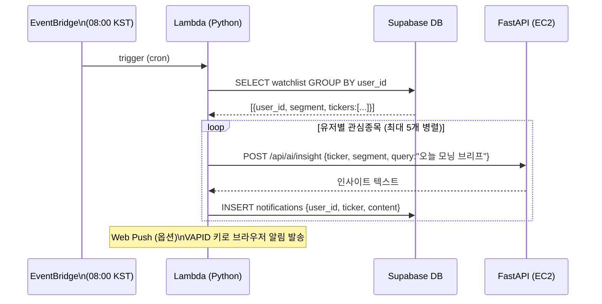

# 기술 스택 명세서 (Tech Stack)

**프로젝트명:** FinSight Agent
**연관 문서:** [PRD.md](./PRD.md)

---

## 전체 시스템 아키텍처



---

## Multi-tool Agent 요청 시퀀스



---

## 모닝 브리프 시퀀스



---

## 1. Frontend & BFF — Next.js

| 항목 | 기술 | 버전 | 선택 근거 |
|---|---|---|---|
| Language | TypeScript | 5.x | 정적 타입, 코드베이스 안전성 |
| Framework | Next.js | 14 (App Router) | SSR + API Route로 BFF 역할 겸임 |
| 인증 | Supabase Auth | - | 이메일/패스워드, 세션 쿠키 관리 내장 |
| Database Client | Supabase SDK | 2.x | profiles · watchlist · insight_history CRUD |
| 실시간 가격 | Yahoo Finance API | - | 종목 가격·시장 요약 온디맨드, next.revalidate 캐시 |
| 스타일링 | Tailwind CSS | 3.x | 세그먼트별 테마 분기 용이 |
| 배포 | Vercel | - | Next.js 최적화 플랫폼, 자동 CI/CD |

---

## 2. AI & Data Backend — FastAPI + LangChain Agent

| 항목 | 기술 | 버전 | 선택 근거 |
|---|---|---|---|
| Language | Python | 3.11+ | 최신 LTS, 타입 힌트 강화 |
| Framework | FastAPI | 0.110+ | 비동기 네이티브, Pydantic 통합, 자동 OpenAPI |
| AI Orchestration | LangChain AgentExecutor | 0.3+ | 도구 선택·실행·결과 종합 루프 구현 표준 |
| LLM | OpenAI GPT-4o-mini | - | 비용 효율적, Tool-calling 지원 |
| Embedding | OpenAI text-embedding-3-small | - | ada-002 대비 5배 저렴, 성능 동등 |
| Vector DB | ChromaDB | 1.0+ | 로컬/서버 모드, 메타데이터 필터, 무료 |
| 데이터 검증 | Pydantic | v2 | 요청/응답 스키마 자동 검증 |
| HTTP 서버 | Uvicorn | - | ASGI 고성능 서버 |
| 패키지 관리 | Poetry | - | 의존성 락파일 관리 |

```python
# agent/tools.py — 5개 도구

@tool
def search_news_tool(query: str, market: str = "KOR") -> str:
    """뉴스·공시 ChromaDB에서 관련 청크를 검색합니다.
    한국 종목은 market='KOR', 미국 종목은 market='US' 전달.
    """

@tool
def get_dart_tool(corp_name: str) -> str:
    """DART에서 기업의 최근 30일 공시 목록을 조회합니다."""

@tool
def get_price_tool(ticker: str) -> str:
    """Yahoo Finance에서 현재가·등락률을 조회합니다.
    한국주식은 '티커.KS' 형식 (예: 005930.KS).
    """

@tool
def price_anomaly_tool(ticker: str) -> str:
    """최근 20일 Z-score로 가격 이상을 감지합니다."""

@tool
def get_financials_tool(ticker: str) -> str:
    """Supabase에서 최신 분기 재무지표(PER, PBR, ROE, 매출, 영업이익)를 조회합니다."""
```

---

## 3. Data Pipeline

| 항목 | 기술 | 선택 근거 |
|---|---|---|
| 뉴스 파이프라인 스케줄러 | GitHub Actions (cron) | 별도 서버 불필요, CI/CD 통합 |
| 재무 파이프라인 스케줄러 | GitHub Actions (workflow_dispatch + 분기 cron) | 뉴스 파이프라인과 독립 관리 |
| 모닝 브리프 스케줄러 | **AWS Lambda + EventBridge** | 일 1회 배치, 상시 구동 불필요, 사실상 무료 |
| 국내 공시 | 금융감독원 OpenDart API | 공시 목록, 재무제표 API |
| 국내 뉴스 | Naver Search API | 카테고리별 멀티쿼리(8개) |
| 미국 뉴스 | NewsAPI | 카테고리별 멀티쿼리(6개) |
| 텍스트 분할 | LangChain RecursiveCharacterTextSplitter | 500토큰 / 50 오버랩 |
| 중복 제거 | URL 기반 dedup.py | 먼저 수집된 카테고리 우선 보존 |

---

## 4. 데이터베이스

### Supabase PostgreSQL

| 테이블 | 주요 컬럼 | 용도 |
|---|---|---|
| `profiles` | user_id(UUID PK), segment(A/B/C) | 사용자 투자 성향 |
| `stocks` | ticker(PK), name, market | KRX + S&P500 종목 목록 |
| `watchlist` | user_id + ticker(unique), name, market | 관심종목 |
| `insight_history` | user_id, ticker, query, answer, sources[] | 인사이트 이력 |
| `financial_metrics` | ticker, period, per, pbr, roe, revenue, op_income | 분기 재무지표 |
| `company_profiles` | ticker, name, sector, industry, description | 기업 개요 |
| `notifications` | user_id, ticker, content, is_read | 모닝 브리프 알림 |

### ChromaDB — Vector DB

| 컬렉션명 | 설명 |
|---|---|
| `news_kor` | 국내 뉴스 + DART 공시 청크 |
| `news_us` | 미국 뉴스 청크 |

---

## 5. 인증 및 보안

| 항목 | 방식 | 비고 |
|---|---|---|
| 사용자 인증 | Supabase Auth (이메일/패스워드) | 세션 쿠키, Supabase 관리형 |
| 내부 서비스 | Internal API Key (`X-Internal-Key`) | Next.js ↔ FastAPI, Lambda ↔ FastAPI |
| 민감 정보 | Vercel 환경변수 / GitHub Secrets / Lambda 환경변수 | OpenAI Key, Supabase Key 등 |
| 라우트 보호 | Next.js middleware.ts | 미인증 자동 리다이렉트 |
| ChromaDB | EC2 내부망 전용 (127.0.0.1:8001) | 외부 직접 접근 불가 |

---

## 6. 인프라 구성

| 서비스 | 환경 | 비고 |
|---|---|---|
| Next.js | Vercel | 자동 CI/CD, 글로벌 CDN |
| Supabase | Supabase Cloud | 관리형 PostgreSQL + Auth |
| FastAPI + ChromaDB | AWS EC2 t3.micro (Docker Compose) | 상시 구동, EBS 영속 볼륨 |
| 모닝 브리프 스케줄러 | AWS Lambda + EventBridge | 일 1회 배치, 사실상 무료 |
| 뉴스 파이프라인 | GitHub Actions | 평일 16:30 KST |
| 재무 파이프라인 | GitHub Actions | 분기 1회 + 수동 실행 |

---

## 7. 기술 선택 요약 및 근거

| 레이어 | 선택 기술 | 대안 | 선택 근거 |
|---|---|---|---|
| Frontend & BFF | Next.js (Vercel) | Remix, SvelteKit | App Router + API Route BFF 겸임, Vercel 최적화 |
| 인증 / DB | Supabase | Firebase, PlanetScale | PostgreSQL + Auth + RLS 통합, 무료 티어 충분 |
| AI Backend | FastAPI | Flask, Django | 비동기 네이티브, Pydantic 자동 검증 |
| AI Agent | LangChain AgentExecutor | LlamaIndex, 직접 구현 | Tool-calling 표준, LCEL 체인과 통합 용이 |
| Vector DB | ChromaDB | Pinecone, Weaviate | 로컬 실행, 무료, 메타데이터 필터 지원 |
| Embedding | text-embedding-3-small | ada-002 | 비용 5배 절감, 성능 동등 |
| LLM | GPT-4o-mini | GPT-4o, Claude 3.5 | Tool-calling 지원, 비용 효율 |
| 모닝 브리프 스케줄러 | AWS Lambda + EventBridge | EC2 APScheduler, Airflow | 상시 구동 불필요 → 사실상 무료, 콜드스타트 허용(배치) |
| Pipeline | GitHub Actions | Airflow, Prefect | 별도 인프라 불필요, 프로젝트 규모 적합 |
